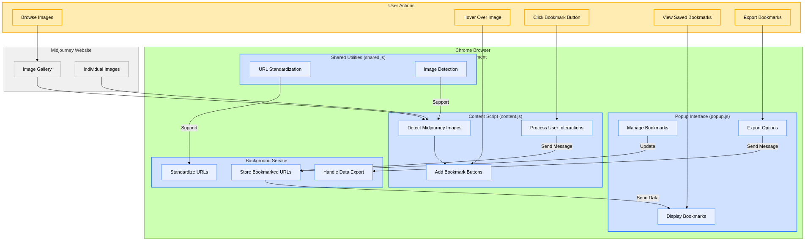
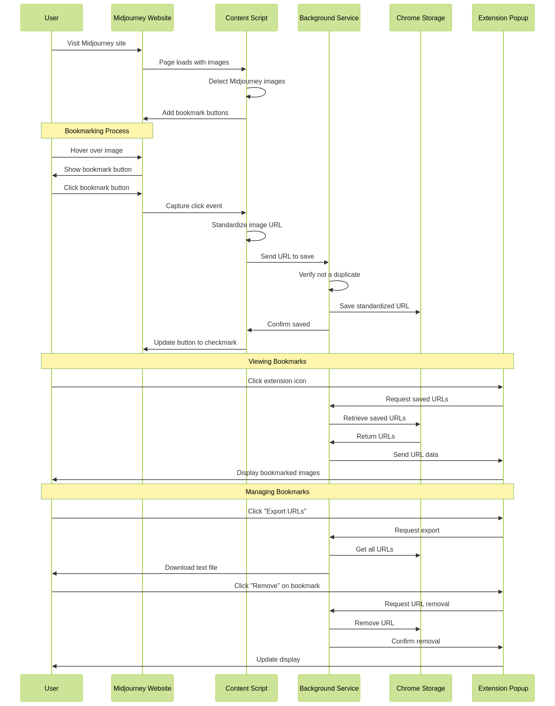

# Midjourney Image Tracker - Chrome Extension

A Chrome extension for tracking and saving Midjourney-generated images with consistent URL formatting and metadata support.




## Features

- Automatically detects Midjourney images on the page
- Adds bookmark buttons to easily save your favorite images
- Standardizes image URLs for consistent tracking
- View and manage all your bookmarks through the popup interface
- Export your collection to a text file


## Installation

1. [Install from Chrome Web Store] (link when available)
2. Or load unpacked from GitHub:
   - Clone this repository
   - Go to chrome://extensions/
   - Enable "Developer mode"
   - Click "Load unpacked" and select the extension directory


## Project Structure

```
midjourney-extension/
├── manifest.json        # Extension configuration
├── src/
│   ├── js/
│   │   ├── shared.js    # Shared utility functions
│   │   ├── background.js # Background service worker
│   │   ├── content.js   # Content script for page interaction
│   │   └── popup.js     # Popup functionality
│   └── css/
│       └── content.css  # Styles for bookmark button
├── popup.html           # Extension popup interface
├── icons/               # Extension icons
│   ├── icon16.png
│   ├── icon48.png
│   └── icon128.png
└── README.md            # Documentation
```

## How It Works



1. Visit the Midjourney website
2. Hover over any image to see the bookmark button
3. Click the button to save the image URL
4. Click the extension icon to view and manage your bookmarks

## Documentation

For more detailed information, see:

- **[Technical Overview](./docs/technical-overview.md)** - Provides a detailed explanation of the architecture, components, and how they work together.
- **[Development Guide](./docs/development-guide.md)** - Offers practical guidance for setting up, modifying, testing, and contributing to the extension.
- **[URL Standardization](./docs/url-standardization.md)** - Focuses specifically on the key URL standardization feature.


## License

This project is licensed under the MIT License - see the LICENSE file for details.

## Contact
barbara - @dagny099

Project Link: https://github.com/dagny099/mj-extension
