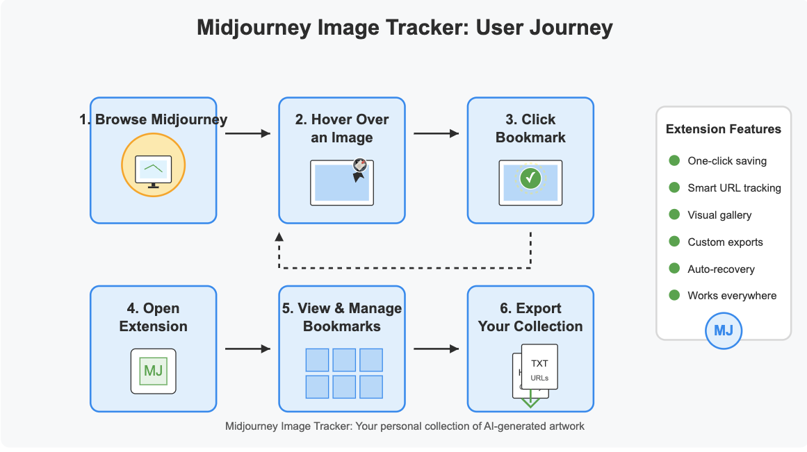
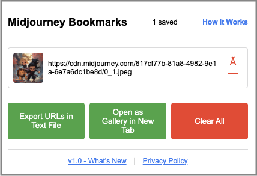
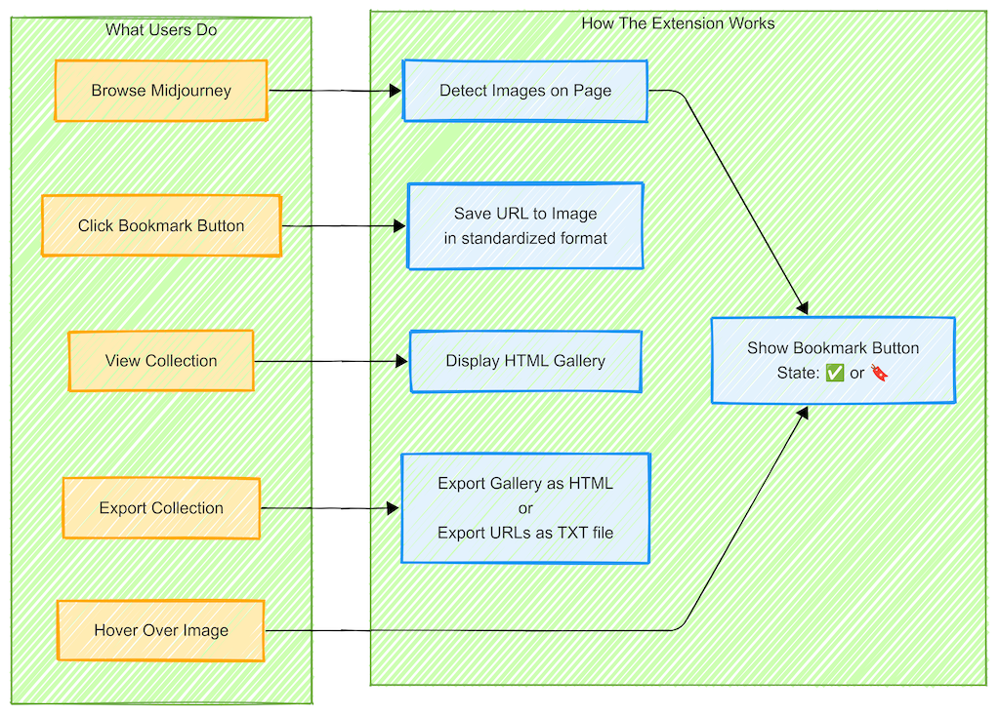

# Midjourney Image Tracker - Chrome Extension

<p style="padding: 15px 20px 0px 5px;"> A lightweight browser extension that lets users bookmark and revisit their favorite Midjourney images in an HTML gallery, enabling consistent URL formatting and metadata support. <p> 



<div style="clear:both;"></div>

## Features


- **Bookmark Midjourney Images**: Easily save your favorite Midjourney-generated images
- **Smart URL Standardization**: Automatically detects and standardizes image URLs to prevent duplicates
- **Organized Gallery View**: View all your bookmarks in a clean, visual gallery
- **Export Options**: Download your bookmarked images as an HTML gallery or as a text file of URLs
- **Hover Interaction**: Bookmark buttons appear when hovering over Midjourney images
- **Cross-Page Support**: Works across various Midjourney site pages

<div style="clear:both;"></div>

## Installation

### From Chrome Web Store (Coming Soon)
1. [Install from Chrome Web Store] (link when available)

### From GitHub (Developer Mode)
1. Clone this repository
2. Go to `chrome://extensions/` in Chrome
3. Enable "Developer mode" using the toggle in the top-right corner
4. Click "Load unpacked" and select the extension directory

## Project Structure

```
midjourney-extension/
├── manifest.json        # Extension configuration
├── src/
│   ├── js/
│   │   ├── shared.js    # Shared utility functions
│   │   ├── background.js # Background service worker
│   │   ├── content.js   # Content script for page interaction
│   │   ├── popup.js     # Popup functionality
│   │   └── gallery.js   # Gallery page functionality
│   └── css/
│       └── content.css  # Styles for bookmark button
├── popup.html           # Extension popup interface
├── gallery.html         # Bookmarked images gallery view
├── instructions.html    # How-to-use guide
├── icons/               # Extension icons
└── LICENSE.md           # MIT License
└── PRIVACY.md           # Privacy Policy
└── README.md            # Documentation
```

## How It Works


#### 1. Browse Midjourney
Visit the Midjourney website (create or explore pages)  

#### 2. Hover & Bookmark
Hover over any Midjourney image to see the bookmark button  

#### 3. Manage Collection
Click the extension icon to view and manage your bookmarks  

#### 4. Export Options
Export your collection as an HTML gallery or a text file   

<div style="clear:both;"></div>

## Key Features

**URL Standardization**  

The extension standardizes different formats of the same Midjourney image URL to prevent duplicate bookmarks. For example:

- Thumbnail format: `https://cdn.midjourney.com/cc4c6c46-bd2a-41da-92c0-a36c2bd2766f/0_0_640_N.webp?method=shortest`
- Full-size format: `https://cdn.midjourney.com/cc4c6c46-bd2a-41da-92c0-a36c2bd2766f/0_0.png`

Both are standardized to: `https://cdn.midjourney.com/cc4c6c46-bd2a-41da-92c0-a36c2bd2766f/0_0.jpeg`

**HTML Gallery and TXT File Export**  

The HTML gallery export feature creates a standalone HTML file with your bookmarked images that you can save locally and view in any browser - even offline.

<br>

## Dive Deeper

For more detailed information, see:

- **[Technical Overview]()** - *[Coming May 2025]* Architecture details and component interactions
- **[Development Guide]()** - *[Coming May 2025]* Setup and contribution guidelines
- **[URL Standardization]()** - *[Coming May 2025]* Deep dive into the URL standardization feature

## License

This project is licensed under the MIT License - see the LICENSE file for details.

## Contact

barbara - @dagny099

Project Link: https://github.com/dagny099/mj-extension