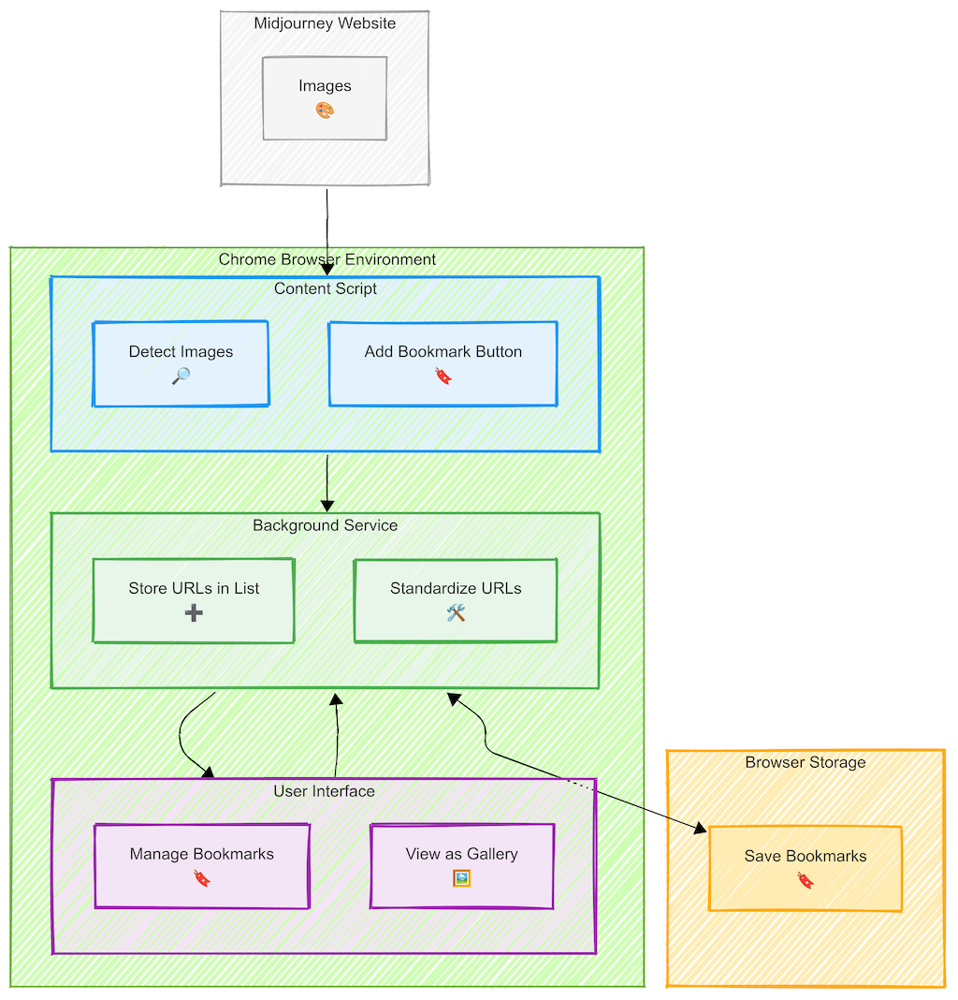

# Midjourney Image Tracker - Chrome Extension

A Chrome extension for tracking and saving Midjourney-generated images with consistent URL formatting and metadata support.


## Features
<div style="float: right; margin: 0 0 10px 10px;">

</div>

- **Bookmark Midjourney Images**: Easily save your favorite Midjourney-generated images
- **Smart URL Standardization**: Automatically detects and standardizes image URLs to prevent duplicates
- **Responsive UI**: Bookmark buttons adapt to different image sizes
- **Organized Gallery View**: View all your bookmarks in a clean, visual gallery
- **Export Options**: Download your bookmarked images as an HTML gallery or as a text file of URLs
- **Hover Interaction**: Bookmark buttons appear when hovering over Midjourney images
- **Cross-Page Support**: Works across various Midjourney site pages

## Installation

### From Chrome Web Store (Coming Soon)
1. [Install from Chrome Web Store] (link when available)

### From GitHub (Developer Mode)
1. Clone this repository
2. Go to `chrome://extensions/` in Chrome
3. Enable "Developer mode" using the toggle in the top-right corner
4. Click "Load unpacked" and select the extension directory

## How It Works
<div style="float: right; margin: 0 0 10px 10px;">

</div>

1. **Browse Midjourney**: Visit the Midjourney website (create or explore pages)  
2. **Hover & Bookmark**: Hover over any Midjourney image to see the bookmark button  
3. **Manage Collection**: Click the extension icon to view and manage your bookmarks  
4. **Export Options**: Export your collection as an HTML gallery or a text file   

**Where You Can Bookmark Images:**   
- ✅ **Midjourney Create Page** (`https://www.midjourney.com/app/create`) – Bookmark icons will appear on hover.  
- ✅ **Midjourney Explore Page** (`https://www.midjourney.com/explore`) – Bookmark icons appear when an image is expanded.  
- ❌ **Main Explore Grid** – Bookmark icons will NOT appear here. Click an image first to expand it.  

## Project Structure

```
midjourney-extension/
├── manifest.json        # Extension configuration
├── src/
│   ├── js/
│   │   ├── shared.js    # Shared utility functions
│   │   ├── background.js # Background service worker
│   │   ├── content.js   # Content script for page interaction
│   │   ├── popup.js     # Popup functionality
│   │   └── gallery.js   # Gallery page functionality
│   └── css/
│       └── content.css  # Styles for bookmark button
├── popup.html           # Extension popup interface
├── gallery.html         # Bookmarked images gallery view
├── instructions.html    # How-to-use guide
├── icons/               # Extension icons
└── LICENSE.md           # MIT License
└── PRIVACY.md           # Privacy Policy
└── README.md            # Documentation
```

## Architecture & Data Flow Overview

The diagram below illustrates the simple but powerful architecture of the Midjourney Image Tracker extension:

<div style="float: right; margin: 0 0 10px 10px;">

</div>

### Overview of Components
- **Content Script:** Detects Midjourney images as you browse and adds bookmark buttons that appear on hover.  
- **Background Service:** Stores and standardizes your bookmarked image URLs to ensure consistent tracking.  
- **User Interface:** Manages your collection through a popup menu and gallery view, accessible via the extension icon.  
- **Browser Storage:** Securely saves your bookmarks locally on your device with no cloud storage required.  


### Data Flow
1. When you visit Midjourney, the Content Script automatically detects images and adds bookmark buttons.
2. Clicking a bookmark button sends the image URL to the Background Service.
3. The Background Service standardizes the URL and stores it in Browser Storage.
4. The User Interface reads from and sends commands to the Background Service.
5. Your bookmarks are stored locally and never leave your device. Read the [Privacy Policy](PRIVACY.md) governing user data practices. 

## Key Features

### URL Standardization

The extension standardizes different formats of the same Midjourney image URL to prevent duplicate bookmarks. For example:

- Thumbnail format: `https://cdn.midjourney.com/cc4c6c46-bd2a-41da-92c0-a36c2bd2766f/0_0_640_N.webp?method=shortest`
- Full-size format: `https://cdn.midjourney.com/cc4c6c46-bd2a-41da-92c0-a36c2bd2766f/0_0.png`

Both are standardized to: `https://cdn.midjourney.com/cc4c6c46-bd2a-41da-92c0-a36c2bd2766f/0_0.jpeg`

### HTML Gallery and TXT File Export

The HTML gallery export feature creates a standalone HTML file with your bookmarked images that you can save locally and view in any browser - even offline.


## Feedback & Contributing

Feedback and contributions are welcome! You can:

1. Submit issues via GitHub
2. Send feedback through the feedback form in the extension
3. Fork the repository and submit pull requests

## Advanced Documentation

For more detailed information, see:

- **[Technical Overview](./docs/technical-overview.md)** - Architecture details and component interactions
- **[Development Guide](./docs/development-guide.md)** - Setup and contribution guidelines
- **[URL Standardization](./docs/url-standardization.md)** - Deep dive into the URL standardization feature

## License

This project is licensed under the MIT License - see the LICENSE file for details.

## Contact

barbara - @dagny099

Project Link: https://github.com/dagny099/mj-extension