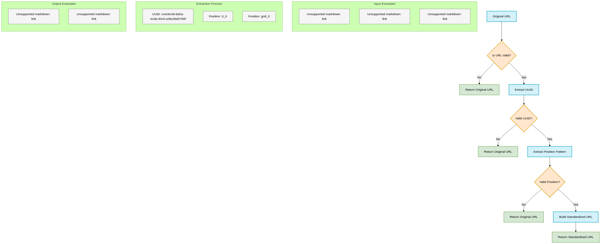

# Midjourney Image Tracker: Technical Overview

This document provides a comprehensive technical overview of the Midjourney Image Tracker Chrome extension, explaining its architecture, components, and how they work together. 

**KEY INFO IN THIS DOCUMENT:**  
- Architecture diagrams showing how components interact  
- Detailed component explanations with expandable technical details  
- Data flow visualization showing how information moves through the system  
- Performance and security considerations  

## Architecture Overview

The extension follows Chrome's recommended architecture for extensions using Manifest V3, with a clear separation of concerns between different components.


### Core Components

The extension consists of four primary components that work together to provide a seamless experience:

1. **Content Script** - Runs in the context of the Midjourney website
2. **Background Service Worker** - Persistent background process
3. **Popup Interface** - User-facing management UI
4. **Shared Utilities** - Common functions used across components

## Component Details

### Content Script (`content.js`)

The content script operates directly within the Midjourney website context, performing these key functions:

```javascript
// Simplified content script example
function processImages() {
  const images = document.querySelectorAll('img');
  
  images.forEach(img => {
    if (isMidjourneyImage(img.src)) {
      const button = createBookmarkButton(img);
      img.parentElement.appendChild(button);
    }
  });
}
```

**Key Features:**
- Image detection using DOM traversal and pattern matching
- Dynamic UI injection (bookmark buttons) onto the page
- Event handling for user interactions
- Communication with the background service

<details>
<summary><strong>Technical Implementation Details</strong> (Click to expand)</summary>

The content script implements a MutationObserver to detect dynamically loaded images:

```javascript
const observer = new MutationObserver(function(mutations) {
  let shouldProcess = false;
  
  mutations.forEach(function(mutation) {
    if (mutation.type === 'childList' && mutation.addedNodes.length) {
      for (let i = 0; i < mutation.addedNodes.length; i++) {
        const node = mutation.addedNodes[i];
        if (node.nodeName === 'IMG' || 
           (node.getElementsByTagName && node.getElementsByTagName('img').length)) {
          shouldProcess = true;
          break;
        }
      }
    }
  });
  
  if (shouldProcess) {
    processImages();
  }
});

observer.observe(document.body, {
  childList: true,
  subtree: true
});
```

This ensures that images loaded dynamically after the initial page load are still detected and processed.
</details>

---

### Background Service Worker (`background.js`)

The diagram below illustrates how the background service worker processes requests and interacts with Chrome's storage APIs. 


**Key Responsibilities:**
- Maintains the collection of saved URLs
- Handles persistent storage operations
- Manages communication between components
- Processes URL standardization
- Handles data export functions

<details>
<summary><strong>Technical Implementation Details</strong> (Click to expand)</summary>

The background service uses Chrome's message passing system to communicate with other components:

```javascript
chrome.runtime.onMessage.addListener((message, sender, sendResponse) => {
  switch (message.type) {
    case 'SAVE_URL':
      const standardizedUrl = standardizeMidjourneyUrl(message.url);
      
      // Check if URL already exists
      if (savedUrls.has(standardizedUrl)) {
        sendResponse({ success: false, message: 'URL already saved' });
        return true;
      }

      // Add new URL with timestamp
      savedUrls.add(standardizedUrl);
      
      // Save to storage
      chrome.storage.local.set({ 
        savedUrls: Array.from(savedUrls)
      }, () => {
        sendResponse({ success: true });
        // Notify content scripts about the update
        notifyContentScripts();
      });
      return true;
      
    // Other message handlers...
  }
});
```
</details>

<details>
<summary><strong>Background Service Flow Explanation</strong> (Click to expand)</summary>

### Message Sources
- **Content Script**: Sends messages like SAVE_URL and REMOVE_URL when users interact with bookmark buttons
- **Popup Interface**: Sends messages like GET_URLS, EXPORT_URLS, and CLEAR_URLS when users interact with the popup

### Background Service Worker
- **Message Handler**: Central point that receives all messages and routes them to appropriate processors
- **In-Memory URL Store**: A JavaScript Set that holds all bookmarked URLs in memory for quick access

### Action Processors
- **Save URL Processor**: Handles bookmark creation
- **Get URLs Processor**: Retrieves bookmarked URLs for display
- **Remove URL Processor**: Removes individual bookmarks
- **Clear URLs Processor**: Removes all bookmarks
- **Export URLs Processor**: Creates a download file with all bookmarks

### Utility Functions
- **URL Standardization**: Converts different URL formats to a consistent format
- **URL Validation**: Ensures URLs are valid Midjourney image URLs
- **Content Script Notification**: Sends update messages to content scripts

### Persistent Storage
- **Chrome Storage API**: Persists bookmarks between browser sessions
- **Chrome Downloads API**: Handles file downloads for exports
</details>


#### Flow Examples:

1. **Saving a URL:**
- Content script sends SAVE_URL message
- Message handler routes to Save URL processor
- URL is standardized
- Memory store is checked for duplicates
- URL is added to memory store
- Changes are persisted to Chrome Storage
- Content scripts are notified of changes

2. **Exporting URLs:**  
- Popup sends EXPORT_URLS message
- Message handler routes to Export URLs processor
- All URLs are retrieved from memory store
- Data is formatted for export
- Chrome Downloads API creates a download file

---

### Popup Interface (`popup.html`/`popup.js`)

The popup provides the user-facing interface for viewing and managing bookmarked images.

**Screenshot:**


**Key Features:**
- Displays thumbnails and URLs of all bookmarked images
- Provides options to remove individual bookmarks
- Allows exporting all bookmarks to a text file
- Supports clearing all bookmarks

<details>
<summary><strong>Technical Implementation Details</strong> (Click to expand)</summary>

The popup dynamically generates content based on the stored bookmarks:

```javascript
function loadUrls() {
  chrome.runtime.sendMessage({ type: 'GET_URLS' }, (response) => {
    if (!response || !response.urls) {
      return;
    }

    const urls = response.urls;
    countDisplay.textContent = `${urls.length} saved`;
    
    if (urls.length === 0) {
      urlList.innerHTML = `
        <div class="empty-state">
          No bookmarked images yet. Hover over Midjourney images to save them.
        </div>
      `;
      return;
    }
    
    urlList.innerHTML = urls.map(({ url, timestamp }) => {
      const standardizedUrl = standardizeMidjourneyUrl(url);
      return `
        <div class="url-item">
          
          <div class="url-text">${standardizedUrl}</div>
          <button class="remove-url" data-url="${standardizedUrl}">×</button>
        </div>
      `;
    }).join('');
  });
}
```
</details>

---

### Shared Utilities (`shared.js`)

The shared utilities module provides common functionality used by multiple components, ensuring consistent behavior.

**URL Standardization Process:**


**Key Functions:**
- URL standardization
- Image detection and validation
- Common utility helpers

<details>
<summary><strong>Technical Implementation Details</strong> (Click to expand)</summary>

The URL standardization function is a core part of the extension:

```javascript
function standardizeMidjourneyUrl(url) {
  if (!url) return url;
  
  // Extract the UUID and position part
  const uuidPattern = /cdn\.midjourney\.com\/([a-f0-9-]{36})/i;
  const uuidMatch = url.match(uuidPattern);
  
  if (!uuidMatch) return url; // Not a Midjourney URL with UUID
  
  const uuid = uuidMatch[1];
  
  // Find the position pattern (e.g., /0_0, /1_2, grid_0, etc.)
  const posPattern = /\/(\d+_\d+|grid_\d+)/;
  const posMatch = url.match(posPattern);
  
  if (posMatch) {
    const position = posMatch[1];
    return `https://cdn.midjourney.com/${uuid}/${position}.jpeg`;
  }
  
  // If no position match found, return original
  return url;
}
```

This ensures that different representations of the same image (thumbnails, full-size views, etc.) are recognized as the same image.
</details>

## Data Flow & Communication

The extension components communicate through Chrome's message passing API, creating a robust and isolated system.

### User Interaction Flow

This sequence diagram illustrates how data flows through the system when a user interacts with the extension:


### Storage Strategy

The extension uses Chrome's Storage API to persist data between browser sessions:

```javascript
// Save to storage
chrome.storage.local.set({ 
  savedUrls: Array.from(savedUrls)
}, callback);

// Load from storage
chrome.storage.local.get(['savedUrls'], (result) => {
  if (result.savedUrls) {
    savedUrls = new Set(result.savedUrls);
  }
});
```

This approach ensures that bookmarks persist even when the browser is closed and reopened.

## Performance Considerations

The extension is designed with performance in mind:

1. **Selective Processing**: Only processes actual Midjourney images, not all images on the page
2. **Efficient DOM Manipulation**: Minimizes layout thrashing when adding UI elements
3. **Deferred Processing**: Uses MutationObserver to process images as they load
4. **URL Set Management**: Uses JavaScript's Set data structure for efficient URL storage and lookups

## Security Measures

Security considerations implemented in the extension:

1. **Content Security Policy**: Restricts script execution to extension resources
2. **URL Sanitization**: Validates URLs before processing
3. **Permission Scoping**: Requests only the minimum permissions required
4. **Safe DOM Manipulation**: Prevents XSS by using safe DOM APIs

## Future Technical Enhancements

The architecture is designed to support future enhancements:

1. **Metadata Extraction**: Framework for extracting and storing image metadata
2. **Sync Support**: Structure prepared for adding Chrome sync capabilities
3. **Advanced Filtering**: Data structure supports adding tagging and filtering
4. **Performance Optimizations**: Further optimizations for handling larger numbers of bookmarks

## Development Tools & Environment

The extension is developed using:

- JavaScript (ES6+)
- Chrome Extension APIs (Manifest V3)
- HTML/CSS for the popup interface
- VS Code for development

## Testing Strategy

The extension is tested using:

- Manual testing on Chrome stable and beta
- Cross-version compatibility testing
- Performance testing with large numbers of bookmarks
- Error handling verification

## Appendix: Technical Diagrams

### Extension File Structure

```
midjourney-extension/
├── manifest.json        # Extension configuration
├── src/
│   ├── js/
│   │   ├── shared.js    # Shared utility functions
│   │   ├── background.js # Background service worker
│   │   ├── content.js   # Content script for page interaction
│   │   └── popup.js     # Popup functionality
│   └── css/
│       └── content.css  # Styles for bookmark button
├── popup.html           # Extension popup interface
├── icons/               # Extension icons
└── docs/                # Documentation
    └── images/          # Documentation images
```

### Error Handling Flow

A diagram illustrating the error handling flow throughout the extension components would be valuable to add here.

---

This technical overview provides insights into the architecture, implementation details, and design decisions of the Midjourney Image Tracker extension. For developers interested in contributing or understanding the codebase, this document serves as a comprehensive starting point.