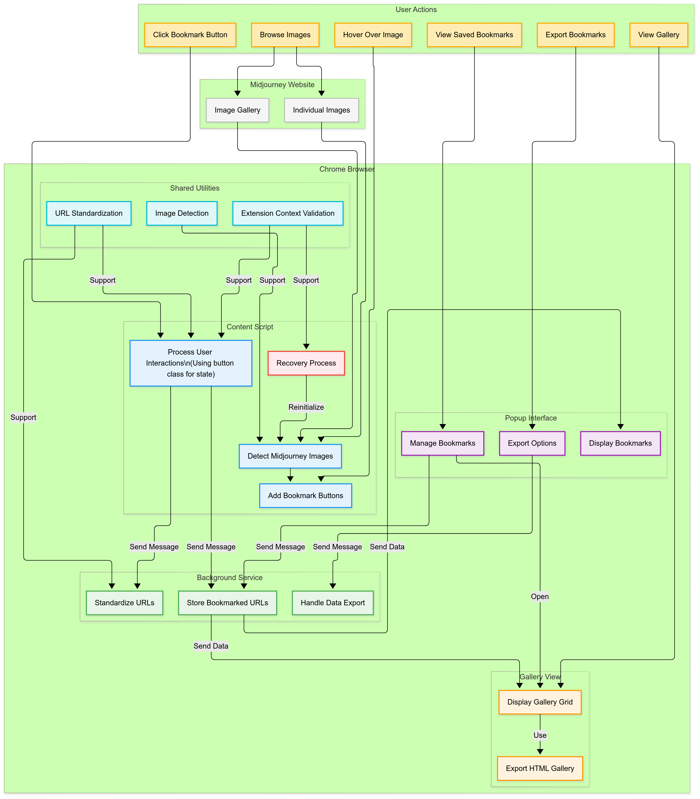

# Midjourney Image Tracker: Technical Overview

This document provides a comprehensive technical overview of the Midjourney Image Tracker Chrome extension, explaining its architecture, components, and how they work together. 

**KEY INFO IN THIS DOCUMENT:**  
- Architecture diagrams showing how components interact  
- Detailed component explanations with expandable technical details  
- Data flow visualization showing how information moves through the system  
- Performance and security considerations
- Error handling and recovery mechanisms

## Architecture Overview

The extension follows Chrome's recommended architecture for extensions using Manifest V3, with a clear separation of concerns between different components.

<div style="float: right; margin: 0 0 10px 10px;">
<a href="./images/mj-extension-architecture-flow-diagram.png" target="_blank"> 
</a>
</div>

### Core Components

The extension consists of five primary components that work together to provide a seamless experience:

1. **Content Script** - Runs in the context of the Midjourney website
2. **Background Service Worker** - Persistent background process
3. **Popup Interface** - User-facing management UI
4. **Gallery View** - Visual display of bookmarked images
5. **Shared Utilities** - Common functions used across components

## Component Details

### Content Script (`content.js`)

The content script operates directly within the Midjourney website context, performing these key functions:

```javascript
// Simplified content script example
function processImages() {
  const images = document.querySelectorAll('img');
  
  images.forEach(img => {
    if (isMidjourneyImage(img.src) && !img.hasAttribute('data-mj-processed')) {
      // Mark image as processed
      img.setAttribute('data-mj-processed', 'true');
      
      // Create and add bookmark button
      const button = createBookmarkButton(img);
      if (button) {
        img.parentElement.appendChild(button);
      }
    }
  });
}
```

**Key Features:**
- Image detection using DOM traversal and pattern matching
- Dynamic UI injection (bookmark buttons) onto the page
- Event handling for user interactions
- Communication with the background service
- Extension context validation and recovery

<details>
<summary><strong>Technical Implementation Details</strong> (Click to expand)</summary>

The content script implements a MutationObserver to detect dynamically loaded images:

```javascript
const observer = new MutationObserver(
  debounce(function(mutations) {
    let shouldProcess = false;
    
    for (const mutation of mutations) {
      if (mutation.type === 'childList' && mutation.addedNodes.length) {
        for (let i = 0; i < mutation.addedNodes.length; i++) {
          const node = mutation.addedNodes[i];
          if (node.nodeName === 'IMG' || 
             (node.getElementsByTagName && node.getElementsByTagName('img').length)) {
            shouldProcess = true;
            break;
          }
        }
        if (shouldProcess) break;
      }
    }
    
    if (shouldProcess) {
      processImages();
    }
  }, DEBOUNCE_DELAY)
);

observer.observe(document.body, {
  childList: true,
  subtree: true
});
```

This ensures that images loaded dynamically after the initial page load are still detected and processed.

**Button Creation and Event Handling:**

```javascript
function createBookmarkButton(img) {
  // Skip if already has a button
  const existingButton = img.parentElement.querySelector('[data-mj-bookmark-btn]');
  if (existingButton) return null;
  
  let button = document.createElement('button');
  const standardizedImgUrl = standardizeMidjourneyUrl(img.src);
  
  // Check if image is already saved (from background)
  const isAlreadySaved = savedUrls.has(standardizedImgUrl);
  
  // Set initial state
  button.className = isAlreadySaved ? 'mj-bookmark-button saved' : 'mj-bookmark-button';
  button.textContent = isAlreadySaved ? '✓' : '🔖';
  button.setAttribute('data-mj-bookmark-btn', 'true');
  button.setAttribute('data-mj-url', standardizedImgUrl);
  
  // Handle click event
  button.addEventListener('click', function(e) {
    e.stopPropagation();
    e.preventDefault();
    
    // Get current state from button's class
    const isCurrentlySaved = button.classList.contains('saved');
    
    if (isCurrentlySaved) {
      // Handle removal
      button.textContent = '🔖';
      button.classList.remove('saved');
      
      chrome.runtime.sendMessage({
        type: 'REMOVE_URL',
        url: standardizedImgUrl
      }, handleResponse);
    } else {
      // Handle addition
      button.textContent = '✓';
      button.classList.add('saved');
      
      chrome.runtime.sendMessage({
        type: 'SAVE_URL',
        url: standardizedImgUrl
      }, handleResponse);
    }
  });
  
  return button;
}
```

**Extension Context Validation:**

```javascript
function isExtensionContextValid() {
  try {
    chrome.runtime.getURL('');
    return true;
  } catch (e) {
    return false;
  }
}

// Check before using Chrome APIs
function updateSavedUrls(callback, forceRefresh = false) {
  if (!isExtensionContextValid()) {
    console.warn('Extension context invalid, cannot update URLs');
    return;
  }
  
  // Rest of function...
}

// Periodic recovery check
setInterval(function() {
  if (!isExtensionContextValid()) {
    // Attempt recovery...
  }
}, 10000);
```
</details>

---

### Background Service Worker (`background.js`)

The background service worker processes requests and interacts with Chrome's storage APIs. 

<div style="float: right; margin: 0 0 10px 10px;">
<a href="./images/mj-extension-background-service-worker-flow-diagram.png" target="_blank"> 
</a>
</div>

**Key Responsibilities:**
- Maintains the collection of saved URLs
- Handles persistent storage operations
- Manages communication between components
- Processes URL standardization
- Handles data export functions

<details>
<summary><strong>Technical Implementation Details</strong> (Click to expand)</summary>

The background service uses Chrome's message passing system to communicate with other components:

```javascript
chrome.runtime.onMessage.addListener((message, sender, sendResponse) => {
  switch (message.type) {
    case 'SAVE_URL':
      const standardizedUrl = standardizeMidjourneyUrl(message.url);
      
      // Check if URL already exists
      if (savedUrls.has(standardizedUrl)) {
        sendResponse({ success: false, message: 'URL already saved' });
        return true;
      }

      // Add new URL
      savedUrls.add(standardizedUrl);
      
      // Save to storage
      chrome.storage.local.set({ 
        savedUrls: Array.from(savedUrls)
      }, () => {
        sendResponse({ success: true });
        // Notify content scripts about the update
        notifyContentScripts();
      });
      return true;
      
    case 'GET_URLS':
      // Send back just the array of URL strings
      sendResponse({ urls: Array.from(savedUrls) });
      return true;
    
    case 'REMOVE_URL':
      // Standardize the URL before removing
      const urlToRemove = standardizeMidjourneyUrl(message.url);
      savedUrls.delete(urlToRemove);
      
      chrome.storage.local.set({ 
        savedUrls: Array.from(savedUrls) 
      }, () => {
        sendResponse({ success: true });
        // Notify content scripts about the update
        notifyContentScripts();
      });
      return true;
    
    // Other message handlers...
  }
});
```

**Notifying Content Scripts:**

```javascript
function notifyContentScripts() {
  chrome.tabs.query({active: true}, (tabs) => {
    tabs.forEach(tab => {
      chrome.tabs.sendMessage(tab.id, { type: 'URLS_UPDATED' })
        .catch(err => {/* Ignore errors for inactive tabs */});
    });
  });
}
```

**Data Export:**

```javascript
case 'EXPORT_URLS':
  const urlList = Array.from(savedUrls).join('\n');
  
  // Create a timestamp in YYYY-MM-DD-HHMM format
  const now = new Date();
  const timestamp = `${now.getFullYear()}-${String(now.getMonth() + 1).padStart(2, '0')}-${String(now.getDate()).padStart(2, '0')}-${String(now.getHours()).padStart(2, '0')}${String(now.getMinutes()).padStart(2, '0')}`;
  const filename = `midjourney-bookmarks-${timestamp}.txt`;
  
  // Use data URL instead of Blob URL
  const dataUrl = 'data:text/plain;charset=utf-8,' + encodeURIComponent(urlList);
  
  chrome.downloads.download({
    url: dataUrl,
    filename: filename,
    saveAs: false  // Don't show Save As dialog, save directly to Downloads
  }, (downloadId) => {
    if (chrome.runtime.lastError) {
      console.error('Download error:', chrome.runtime.lastError);
      sendResponse({ success: false, error: chrome.runtime.lastError });
    } else {
      sendResponse({ success: true });
    }
  });
  return true;
```
</details>

<details>
<summary><strong>Background Service Flow Explanation</strong> (Click to expand)</summary>

### Message Sources
- **Content Script**: Sends messages like SAVE_URL and REMOVE_URL when users interact with bookmark buttons
- **Popup Interface**: Sends messages like GET_URLS, EXPORT_URLS, and CLEAR_URLS when users interact with the popup

### Background Service Worker
- **Message Handler**: Central point that receives all messages and routes them to appropriate processors
- **In-Memory URL Store**: A JavaScript Set that holds all bookmarked URLs in memory for quick access

### Action Processors
- **Save URL Processor**: Handles bookmark creation
- **Get URLs Processor**: Retrieves bookmarked URLs for display
- **Remove URL Processor**: Removes individual bookmarks
- **Clear URLs Processor**: Removes all bookmarks
- **Export URLs Processor**: Creates a download file with all bookmarks

### Utility Functions
- **URL Standardization**: Converts different URL formats to a consistent format
- **URL Validation**: Ensures URLs are valid Midjourney image URLs
- **Content Script Notification**: Sends update messages to content scripts

### Persistent Storage
- **Chrome Storage API**: Persists bookmarks between browser sessions
- **Chrome Downloads API**: Handles file downloads for exports
</details>


#### Flow Examples:

1. **Saving a URL:**
- Content script sends SAVE_URL message
- Message handler routes to Save URL processor
- URL is standardized
- Memory store is checked for duplicates
- URL is added to memory store
- Changes are persisted to Chrome Storage
- Content scripts are notified of changes

2. **Exporting URLs:**  
- Popup sends EXPORT_URLS message
- Message handler routes to Export URLs processor
- All URLs are retrieved from memory store
- Data is formatted for export
- Chrome Downloads API creates a download file

---

### Popup Interface (`popup.html`/`popup.js`)

The popup provides the user-facing interface for viewing and managing bookmarked images.

**Key Features:**
- Displays thumbnails and URLs of all bookmarked images
- Shows count of saved bookmarks
- Provides options to remove individual bookmarks
- Allows exporting all bookmarks to a text file or HTML gallery
- Supports clearing all bookmarks
- Includes helpful documentation links

<details>
<summary><strong>Technical Implementation Details</strong> (Click to expand)</summary>

The popup dynamically generates content based on the stored bookmarks:

```javascript
function loadUrls() {
  chrome.runtime.sendMessage({ type: 'GET_URLS' }, (response) => {
    if (!response || !response.urls) {
      return;
    }

    const urls = response.urls;
    
    // Update the count display
    const countDisplay = document.getElementById('countDisplay');
    if (countDisplay) {
      countDisplay.textContent = `${urls.length} saved`;
    }
    
    if (urls.length === 0) {
      urlList.innerHTML = `
        <div class="empty-state">
          No bookmarked images yet. Hover over Midjourney images to save them.
        </div>
      `;
      return;
    }
    
    urlList.innerHTML = urls.map(url => {
      return `
        <div class="url-item">
          
          <div class="url-text">${url}</div>
          <button class="remove-url" data-url="${url}">×</button>
        </div>
      `;
    }).join('');
    
    // Add event listeners to remove buttons
    document.querySelectorAll('.remove-url').forEach(button => {
      button.addEventListener('click', (e) => {
        const url = e.target.dataset.url;
        chrome.runtime.sendMessage({
          type: 'REMOVE_URL',
          url: url
        }, (response) => {
          if (response && response.success) {
            loadUrls(); // Refresh the list
          }
        });
      });
    });
  });
}
```

**Export Functionality:**

```javascript
// Handle export button
exportButton.addEventListener('click', () => {
  chrome.runtime.sendMessage({ type: 'EXPORT_URLS' });
});

// Handle gallery export button
exportGalleryButton.addEventListener('click', () => {
  chrome.tabs.create({ url: chrome.runtime.getURL("gallery.html") });
});
```

**Version Check and What's New Dialog:**

```javascript
function checkForUpdates() {
  const currentVersion = chrome.runtime.getManifest().version;
  
  chrome.storage.local.get(['lastVersion'], (result) => {
    const lastVersion = result.lastVersion;
    
    if (!lastVersion) {
      // First install
      showWhatsNew('Welcome to Midjourney Image Tracker!', [
        'Hover over Midjourney images to bookmark them',
        'Use this popup to manage your bookmarks',
        'Export your collection with one click'
      ]);
    } else if (lastVersion !== currentVersion) {
      // Update from previous version
      showWhatsNew(`What's New in v${currentVersion}`, [
        'Improved bookmark button reliability',
        'Better error handling and recovery',
        'Export images as an HTML gallery'
      ]);
    }
    
    // Save current version
    chrome.storage.local.set({ lastVersion: currentVersion });
  });
}
```
</details>

---

### Gallery View (`gallery.html`/`gallery.js`)

The gallery provides a visual display of all bookmarked images in a grid layout.

**Key Features:**
- Visual grid display of bookmarked images
- Direct links to original images
- Download option for saving the gallery as HTML
- Responsive design for various screen sizes
- Timestamp for when the gallery was exported

<details>
<summary><strong>Technical Implementation Details</strong> (Click to expand)</summary>

The gallery loads and displays all bookmarked URLs:

```javascript
document.addEventListener('DOMContentLoaded', () => {
  // Fetch stored URLs from Chrome storage
  chrome.runtime.sendMessage({ type: 'GET_URLS' }, (response) => {
    if (!response || !response.urls || response.urls.length === 0) {
      document.getElementById('gallery').innerHTML = "<p style='text-align: center;'>No bookmarked images.</p>";
      return;
    }

    document.getElementById('exportTimestamp').textContent = `Exported on ${new Date().toLocaleString()}`;

    // Create gallery images
    document.getElementById('gallery').innerHTML = response.urls.map(url => `
      <div class="item">
        <a href="${url}" target="_blank">
          
        </a>
        <div class="item-footer">
          <a href="${url}" target="_blank">${url}</a>
        </div>
      </div>
    `).join('');
  });

  // Implement "Download This Page" with timestamp
  document.getElementById('downloadGallery').addEventListener('click', () => {
    // Create a timestamp in YYYY-MM-DD-HHMM format
    const now = new Date();
    const timestamp = `${now.getFullYear()}-${String(now.getMonth() + 1).padStart(2, '0')}-${String(now.getDate()).padStart(2, '0')}-${String(now.getHours()).padStart(2, '0')}${String(now.getMinutes()).padStart(2, '0')}`;
    
    // Create filename with timestamp
    const filename = `midjourney-gallery-${timestamp}.html`;
    
    const blob = new Blob([document.documentElement.outerHTML], { type: 'text/html' });
    const url = URL.createObjectURL(blob);
    const a = document.createElement('a');
    a.href = url;
    a.download = filename;
    document.body.appendChild(a);
    a.click();
    document.body.removeChild(a);
    URL.revokeObjectURL(url);
  });
});
```
</details>

---

### Shared Utilities (`shared.js`)

The shared utilities module provides common functionality used by multiple components, ensuring consistent behavior.

**URL Standardization Process:**

**Key Functions:**
- URL standardization
- Image detection and validation
- Extension context validation
- Common utility helpers

<details>
<summary><strong>Technical Implementation Details</strong> (Click to expand)</summary>

The URL standardization function is a core part of the extension:

```javascript
function standardizeMidjourneyUrl(url) {
  if (!url) return url;

  // Convert to lowercase for consistency
  url = url.toLowerCase();

  // Remove any query parameters (e.g., ?someParam=value)
  url = url.split('?')[0];

  // Extract UUID from Midjourney URLs
  const uuidPattern = /cdn\.midjourney\.com\/([a-f0-9-]{36})/i;
  const uuidMatch = url.match(uuidPattern);
  
  if (!uuidMatch) return url; // Not a valid Midjourney URL

  const uuid = uuidMatch[1];

  // Extract position (e.g., /0_0, /1_2, grid_0, etc.)
  const posPattern = /\/(\d+_\d+|grid_\d+)/;
  const posMatch = url.match(posPattern);
  
  if (posMatch) {
    const position = posMatch[1];
    return `https://cdn.midjourney.com/${uuid}/${position}.jpeg`;
  }

  // Fallback: If no position pattern is found, return a base standard URL
  return `https://cdn.midjourney.com/${uuid}/default.jpeg`;
}
```

**Image Detection:**

```javascript
function isMidjourneyImage(url) {
  if (!url) return false;
  return url.includes('cdn.midjourney.com') && url.match(/[a-f0-9-]{36}/i);
}
```

**Extension Context Validation (shared implementation):**

```javascript
function isExtensionContextValid() {
  try {
    // This will throw if context is invalid
    chrome.runtime.getURL('');
    return true;
  } catch (e) {
    return false;
  }
}
```
</details>

## Data Flow & Communication

The extension components communicate through Chrome's message passing API, creating a robust and isolated system.

### User Interaction Flow

This sequence diagram illustrates how data flows through the system when a user interacts with the extension:

<div style="float: right; margin: 0 0 10px 10px;">
<a href="./images/mj-extension-sequence-flow-diagram.png" target="_blank"> 
</a>
</div>

### Storage Strategy

The extension uses Chrome's Storage API to persist data between browser sessions:

```javascript
// Save to storage
chrome.storage.local.set({ 
  savedUrls: Array.from(savedUrls)
}, callback);

// Load from storage
chrome.storage.local.get(['savedUrls'], (result) => {
  if (result.savedUrls) {
    savedUrls = new Set(result.savedUrls);
  }
});
```

This approach ensures that bookmarks persist even when the browser is closed and reopened.

## Performance Considerations

The extension is designed with performance in mind:

1. **Selective Processing**: 
   - Only processes actual Midjourney images, not all images on the page
   - Skips already processed images

2. **Efficient DOM Manipulation**: 
   - Minimizes layout thrashing when adding UI elements
   - Uses appropriate CSS for smooth animations and transitions

3. **Deferred Processing**: 
   - Uses MutationObserver with debounce to process images as they load
   - Prevents duplicate bookmark buttons on the same image

4. **URL Set Management**: 
   - Uses JavaScript's Set data structure for efficient URL storage and lookups
   - Ensures standardized URLs to prevent duplicates

5. **Button Event Optimization**:
   - Uses the button's own state rather than closure variables
   - Properly prevents event propagation

## Error Handling and Recovery

The extension implements several error handling and recovery mechanisms:

1. **Extension Context Validation**:
   - Checks if extension context is valid before using Chrome APIs
   - Prevents uncaught errors when extension is reloaded

2. **Automatic Recovery**:
   - Periodically checks for extension context validity
   - Reinitializes if context becomes invalid

3. **Chrome API Error Handling**:
   - Wraps Chrome API calls in try/catch blocks
   - Provides appropriate fallbacks when errors occur

4. **State Consistency**:
   - Uses button classes to track current state
   - Forces refreshes of saved URLs cache after operations

5. **Notification System**:
   - Notifies content scripts when bookmark list changes
   - Ensures all tabs stay in sync with the current saved state

```javascript
// Example of error handling and recovery
function attemptRecovery() {
  if (!isExtensionContextValid()) {
    console.log('Extension context invalid, attempting recovery...');
    
    // Remove all existing buttons
    document.querySelectorAll('[data-mj-bookmark-btn]').forEach(btn => {
      try {
        btn.remove();
      } catch (e) {
        console.error('Error removing button:', e);
      }
    });
    
    // Reset processing flags
    document.querySelectorAll('[data-mj-processed]').forEach(img => {
      try {
        img.removeAttribute('data-mj-processed');
      } catch (e) {
        console.error('Error resetting image:', e);
      }
    });
    
    // Reset initialization state
    initialized = false;
    
    // Attempt to reinitialize
    setTimeout(initialize, 500);
  }
}

// Periodic check
setInterval(attemptRecovery, 10000);
```

## Security Measures

Security considerations implemented in the extension:

1. **Content Security Policy**: 
   - Restricts script execution to extension resources
   - Prevents execution of arbitrary code

2. **URL Sanitization**: 
   - Validates and standardizes URLs before processing
   - Prevents injection attacks through URLs

3. **Permission Scoping**: 
   - Requests only the minimum permissions required
   - Uses specifically targeted host permissions

4. **Safe DOM Manipulation**: 
   - Prevents XSS by using safe DOM APIs
   - Properly escapes user-generated content

5. **Data Storage Safety**:
   - Uses chrome.storage.local for secure, isolated storage
   - Prevents other extensions from accessing the stored data

## Future Technical Enhancements

The architecture is designed to support future enhancements:

1. **Metadata Extraction**: 
   - Framework for extracting and storing image metadata
   - Ability to filter and sort images by metadata

2. **Sync Support**: 
   - Structure prepared for adding Chrome sync capabilities
   - Enable cross-device synchronization of bookmarks

3. **Advanced Filtering**: 
   - Data structure supports adding tagging and filtering
   - Search functionality for finding specific bookmarks

4. **Performance Optimizations**: 
   - Further optimizations for handling larger numbers of bookmarks
   - Improved caching strategies

5. **User Interface Enhancements**:
   - Dark mode support
   - Customizable gallery layouts
   - Additional export formats

## Development Tools & Environment

The extension is developed using:

- JavaScript (ES6+)
- Chrome Extension APIs (Manifest V3)
- HTML/CSS for the popup and gallery interfaces
- VS Code for development

## Testing Strategy

The extension is tested using:

- Manual testing on Chrome stable and beta
- Cross-version compatibility testing
- Performance testing with large numbers of bookmarks
- Error handling verification
- Extension context recovery testing

## Appendix: Technical Diagrams

### Extension File Structure

```
midjourney-extension/
├── manifest.json        # Extension configuration
├── src/
│   ├── js/
│   │   ├── shared.js    # Shared utility functions
│   │   ├── background.js # Background service worker
│   │   ├── content.js   # Content script for page interaction
│   │   ├── popup.js     # Popup functionality
│   │   └── gallery.js   # Gallery functionality
│   └── css/
│       └── content.css  # Styles for bookmark button
├── popup.html           # Extension popup interface
├── gallery.html         # Gallery view for bookmarks
├── instructions.html    # User guide
├── icons/               # Extension icons
└── docs/                # Documentation
    └── images/          # Documentation images
└── LICENSE.md           # MIT License
└── PRIVACY.md           # Privacy Policy
└── README.md            # README!
```

---

This technical overview provides insights into the architecture, implementation details, and design decisions of the Midjourney Image Tracker extension. For developers interested in contributing or understanding the codebase, this document serves as a comprehensive starting point.
