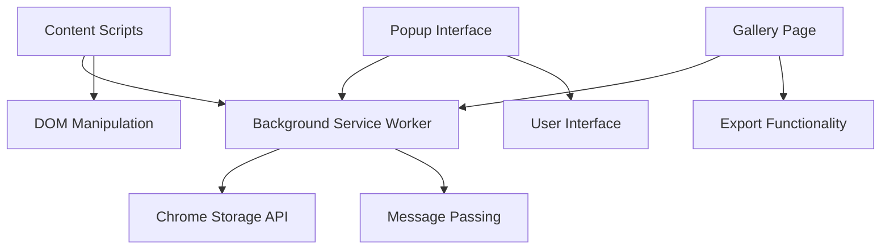

# Development Setup Guide

This guide walks you through setting up a development environment for contributing to Midjourney Image Tracker. Whether you're fixing bugs, adding features, or just exploring the codebase, this will get you started.

## Prerequisites

### Required Software

<div class="grid cards" markdown>

-   :material-google-chrome: **Chrome Browser**

    ---

    Latest version of Chrome for testing the extension in development mode.
    
    [Download Chrome](https://chrome.google.com/){ .md-button }

-   :material-git: **Git**

    ---

    For version control and contributing back to the project.
    
    [Install Git](https://git-scm.com/){ .md-button }

-   :material-code-braces: **Code Editor**

    ---

    VS Code recommended with extensions for JavaScript/HTML/CSS development.
    
    [Download VS Code](https://code.visualstudio.com/){ .md-button }

</div>

### Recommended VS Code Extensions

```json title=".vscode/extensions.json"
{
  "recommendations": [
    "ms-vscode.vscode-chrome-debug",
    "bradlc.vscode-tailwindcss", 
    "ms-vscode.vscode-json",
    "formulahendry.auto-rename-tag",
    "christian-kohler.path-intellisense"
  ]
}
```

## Project Setup

### 1. Clone the Repository

```bash
# Clone the project
git clone https://github.com/dagny099/mj-extension.git

# Navigate to project directory  
cd mj-extension

# Check project structure
ls -la
```

Expected directory structure:
```
mj-extension/
├── src/js/           # Extension JavaScript files
├── src/css/          # Extension CSS files  
├── icons/            # Extension icons
├── docs/             # Documentation source
├── manifest.json     # Extension manifest
├── popup.html        # Extension popup interface
├── gallery.html      # Gallery export template
├── instructions.html # User instructions page
└── README.md         # Project documentation
```

### 2. Load Extension in Chrome

Since this is a Chrome extension, there's no build process - you load the source directly:

<div class="installation-step">
  <div class="step-number">1</div>
  <div class="step-content">
    <strong>Open Chrome Extensions</strong><br>
    Navigate to <code>chrome://extensions/</code> in Chrome.
  </div>
</div>

<div class="installation-step">
  <div class="step-number">2</div>
  <div class="step-content">
    <strong>Enable Developer Mode</strong><br>
    Toggle "Developer mode" in the top-right corner.
  </div>
</div>

<div class="installation-step">
  <div class="step-number">3</div>
  <div class="step-content">
    <strong>Load Unpacked Extension</strong><br>
    Click "Load unpacked" and select your <code>mj-extension</code> directory.
  </div>
</div>

<div class="installation-step">
  <div class="step-number">4</div>
  <div class="step-content">
    <strong>Verify Installation</strong><br>
    You should see the Midjourney Image Tracker in your extensions list and toolbar.
  </div>
</div>

### 3. Development Workflow

#### Making Changes

1. **Edit source files** in your preferred editor
2. **Reload extension** in `chrome://extensions/` (click refresh icon)
3. **Test changes** on Midjourney pages
4. **Repeat** until satisfied

!!! tip "Hot Reloading"

    Chrome extensions don't hot-reload automatically. You must manually reload the extension after each change using the refresh button in `chrome://extensions/`.

#### Testing Changes

**Content Script Changes** (`src/js/content.js`, `src/css/content.css`):
- Reload extension in `chrome://extensions/`  
- Refresh Midjourney pages to see changes

**Background Script Changes** (`src/js/background.js`):
- Reload extension in `chrome://extensions/`
- Changes take effect immediately

**Popup Changes** (`popup.html`, `src/js/popup.js`):
- Reload extension in `chrome://extensions/`
- Close and reopen extension popup

## Development Environment

### Browser Setup

#### Extension Debugging Tools

**Background Script Console**:
```
chrome://extensions/ → Midjourney Image Tracker → "Inspect views: service worker"
```

**Content Script Console**:
```
F12 on any Midjourney page → Console tab
```

**Popup Debugging**:
```
Right-click extension icon → "Inspect popup"
```

#### Useful Chrome Flags

For development, you might want to enable:
```bash
# Launch Chrome with useful debugging flags
chrome --enable-logging --log-level=0 --enable-extension-activity-logging
```

### Development Configuration

#### VS Code Workspace Settings

```json title=".vscode/settings.json"
{
  "files.exclude": {
    "**/.DS_Store": true,
    "**/node_modules": true
  },
  "emmet.includeLanguages": {
    "html": "html"
  },
  "html.suggest.html5": true,
  "css.validate": true,
  "javascript.validate.enable": true
}
```

#### Chrome Extension Debugger

Create a launch configuration for debugging:

```json title=".vscode/launch.json"
{
  "version": "0.2.0",
  "configurations": [
    {
      "name": "Launch Chrome with Extension",
      "type": "chrome", 
      "request": "launch",
      "url": "https://www.midjourney.com/explore",
      "userDataDir": "${workspaceFolder}/.chrome-profile",
      "args": [
        "--load-extension=${workspaceFolder}"
      ]
    }
  ]
}
```

## Codebase Overview

### Architecture Understanding

The extension follows Chrome Extension Manifest V3 architecture:



### Key Files to Understand

**Core Logic**:
```
src/js/shared.js      # URL standardization utilities
src/js/background.js  # Service worker (data storage)
src/js/content.js     # Page interaction (bookmark buttons)
src/js/popup.js       # Main user interface
src/js/gallery.js     # Export gallery functionality
```

**Configuration**:
```
manifest.json         # Extension permissions & metadata
popup.html           # Popup interface structure  
gallery.html         # Export template
```

**Styling**:
```
src/css/content.css  # Bookmark button styles
```

### Code Style Guidelines

#### JavaScript Conventions

```javascript
// Use descriptive function names
function standardizeMidjourneyUrl(url) { /* ... */ }

// Use camelCase for variables
const savedUrls = new Set();

// Use JSDoc comments for functions
/**
 * Standardizes Midjourney URLs to prevent duplicates
 * @param {string} url - The URL to standardize
 * @return {string} - The standardized URL
 */
```

#### CSS Conventions

```css
/* Use BEM-like naming for extension styles */
.mj-bookmark-btn { /* ... */ }
.mj-bookmark-btn--active { /* ... */ }
.mj-bookmark-btn__icon { /* ... */ }

/* Avoid conflicts with Midjourney's styles */
.mj-extension-popup { /* ... */ }
```

#### HTML Structure

```html
<!-- Use semantic HTML -->
<button class="mj-bookmark-btn" aria-label="Bookmark this image">
  <span class="mj-bookmark-btn__icon" aria-hidden="true">🔖</span>
</button>

<!-- Include accessibility attributes -->
<div role="dialog" aria-labelledby="popup-title">
```

## Testing Framework

### Manual Testing Checklist

Since this extension doesn't have automated tests, use this manual testing process:

#### Basic Functionality
- [ ] Extension loads without errors in `chrome://extensions/`
- [ ] Bookmark buttons appear on Midjourney images
- [ ] Clicking bookmark saves URL successfully
- [ ] Popup shows saved bookmarks with thumbnails
- [ ] Export functions generate valid files

#### Cross-Page Testing
- [ ] Works on `midjourney.com/create`
- [ ] Works on `midjourney.com/explore`  
- [ ] Works on `midjourney.com/community`
- [ ] Works on user profile pages

#### Edge Cases
- [ ] Handles duplicate URLs correctly
- [ ] Works with different image formats (PNG, WebP, JPEG)
- [ ] Graceful handling of network errors
- [ ] Proper cleanup when extension context invalidated

#### Performance Testing
- [ ] No noticeable lag when hovering over images
- [ ] Popup loads quickly with 100+ bookmarks
- [ ] Export functions complete in reasonable time
- [ ] No memory leaks during extended usage

### Debugging Techniques

#### Console Logging

Add debug logging throughout your development:

```javascript
// Background script debugging
console.log('[Background] Processing message:', message);

// Content script debugging  
console.log('[Content] Found Midjourney image:', imageUrl);

// Popup debugging
console.log('[Popup] Rendering bookmarks:', urls.length);
```

#### Performance Monitoring

```javascript
// Measure URL standardization performance
console.time('URL Standardization');
const result = standardizeMidjourneyUrl(url);
console.timeEnd('URL Standardization');

// Monitor storage usage
chrome.runtime.sendMessage({ type: 'GET_EXTENSION_INFO' }, (info) => {
  console.log('Storage usage:', info.data.storageUsed);
});
```

#### Error Handling

```javascript
// Comprehensive error logging
chrome.runtime.onMessage.addListener((message, sender, sendResponse) => {
  try {
    // ... message handling
  } catch (error) {
    console.error('Message handling failed:', error);
    sendResponse({ success: false, error: error.message });
  }
});
```

## Common Development Tasks

### Adding New Features

#### 1. Plan the Feature

- Identify which extension context(s) need changes
- Design the message passing interface if needed
- Consider storage requirements and performance impact
- Plan the user interface changes

#### 2. Implement Backend Logic

If the feature requires data storage:

```javascript
// Add to background.js message handler
case 'NEW_FEATURE':
  const result = handleNewFeature(message.data);
  sendResponse({ success: true, data: result });
  break;
```

#### 3. Update UI Components

For popup features:
```javascript
// Add to popup.js
function renderNewFeature(data) {
  const container = document.createElement('div');
  container.className = 'new-feature-container';
  // ... render feature UI
}
```

For content script features:
```javascript
// Add to content.js
function enhanceBookmarkButton(button, additionalData) {
  // ... add new functionality to bookmark buttons
}
```

#### 4. Test Thoroughly

- Test the new feature across different Midjourney pages
- Verify it doesn't break existing functionality
- Check performance impact with large bookmark collections
- Test edge cases and error conditions

### Fixing Bugs

#### 1. Reproduce the Issue

- Create a minimal test case that reproduces the bug
- Document the exact steps and expected vs actual behavior
- Test across different scenarios (different pages, bookmark counts, etc.)

#### 2. Locate the Root Cause

- Use browser developer tools to trace the issue
- Add temporary logging to narrow down the problem
- Check for Chrome extension API changes that might affect behavior

#### 3. Implement the Fix

- Make the minimal change necessary to fix the issue
- Ensure the fix doesn't introduce new problems
- Add comments explaining the fix if the solution isn't obvious

#### 4. Verify the Fix

- Test the original bug scenario to confirm it's resolved
- Run through the full manual testing checklist
- Test with both small and large bookmark collections

## Contributing Guidelines

### Code Quality

**Before submitting changes:**

- [ ] Code follows project conventions
- [ ] No console.log statements in final code (use proper logging)
- [ ] All functions have JSDoc comments
- [ ] HTML includes proper accessibility attributes
- [ ] CSS doesn't conflict with Midjourney's styles

### Git Workflow

```bash
# Create feature branch
git checkout -b feature/your-feature-name

# Make your changes
# ... edit files ...

# Stage and commit changes
git add .
git commit -m "Add feature: descriptive commit message"

# Push to your fork
git push origin feature/your-feature-name

# Create pull request through GitHub interface
```

### Pull Request Guidelines

**PR Description should include:**

- Clear description of what the change does
- Why the change is necessary  
- Testing steps to verify the change works
- Screenshots for UI changes
- Any breaking changes or migration steps needed

**Before submitting PR:**

- [ ] Extension loads without errors
- [ ] All existing functionality still works
- [ ] New feature is thoroughly tested
- [ ] Code is clean and well-documented
- [ ] No sensitive data (API keys, personal info) included

## Resources for Extension Development

### Chrome Extension Documentation

- [Chrome Extension Developer Guide](https://developer.chrome.com/docs/extensions/)
- [Manifest V3 Migration Guide](https://developer.chrome.com/docs/extensions/mv3/intro/)
- [Chrome Extension API Reference](https://developer.chrome.com/docs/extensions/reference/)

### JavaScript/Web Development

- [MDN Web Docs](https://developer.mozilla.org/) - Comprehensive web technology reference
- [Chrome DevTools Documentation](https://developer.chrome.com/docs/devtools/) - Debugging tools
- [Web Accessibility Guidelines](https://www.w3.org/WAI/WCAG21/quickref/) - Accessibility best practices

### Project-Specific Resources

- [Technical Architecture](../technical/architecture.md) - Deep dive into extension design
- [API Reference](../technical/api-reference.md) - Internal message passing API
- [User Guide](../getting-started/user-guide.md) - Understanding user workflows

---

You're now ready to start developing! Remember that Chrome extension development is different from traditional web development - you're working within Chrome's extension sandbox with special APIs and security restrictions. Take time to understand the extension context before making major changes.