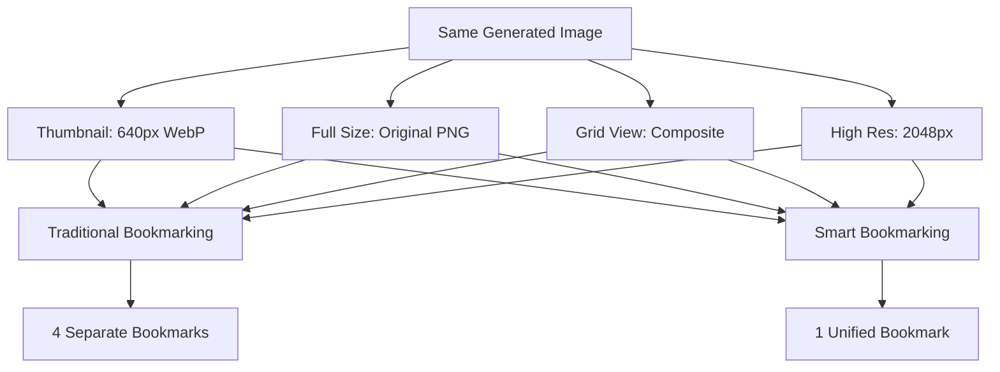
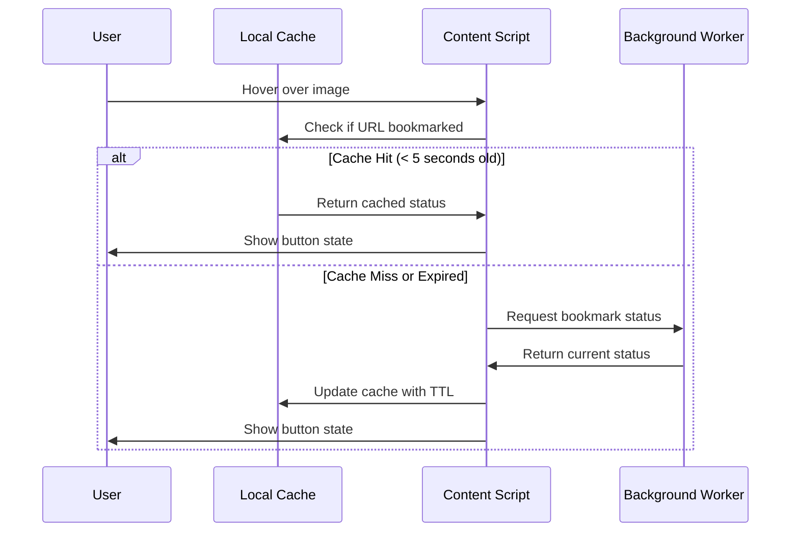

# Smart Bookmarking

The heart of Midjourney Image Tracker is its intelligent bookmarking system that makes collecting AI-generated artwork effortless while ensuring perfect organization.

## How It Works

### Hover-Activated Interface

The extension uses an elegant hover-to-reveal system that keeps Midjourney's interface clean while providing instant access to bookmarking functionality:

<div class="grid" markdown>

<div class="grid-item" markdown>

**🎯 Precise Detection**

Only genuine Midjourney images from `cdn.midjourney.com` trigger bookmark buttons, ensuring you never accidentally bookmark unrelated content.

</div>

<div class="grid-item" markdown>

**⚡ Instant Response**

Bookmark buttons appear within 50ms of hovering, providing immediate visual feedback without interrupting your browsing flow.

</div>

<div class="grid-item" markdown>

**🎨 Non-Intrusive Design**

Buttons blend seamlessly with Midjourney's aesthetic, appearing as subtle overlays that don't distract from the artwork.

</div>

<div class="grid-item" markdown>

**📱 Cross-Device Consistency**

Works identically across all Midjourney pages - Create, Explore, Community, and user profiles.

</div>

</div>

### Visual States & Feedback

The bookmark system provides clear visual indicators for different states:

=== "Available to Bookmark"
    ```
    🔖 Empty bookmark icon
    ↳ Click to add to collection
    ```

=== "Already Bookmarked"
    ```
    📌 Filled bookmark icon  
    ↳ Click to remove from collection
    ```

=== "Processing"
    ```
    ⏳ Loading indicator
    ↳ Wait for operation to complete
    ```

=== "Error State"
    ```
    ⚠️ Error indicator
    ↳ Hover for error message
    ```

## Intelligent Duplicate Prevention

### The Challenge

Midjourney serves the same image in multiple formats depending on context. Without smart handling, you could end up with dozens of "duplicate" bookmarks:



### The Solution: URL Standardization

Our proprietary algorithm recognizes that these different URLs represent the same artwork:

**Input URLs (Different Formats)**:
```javascript
// Thumbnail format
"https://cdn.midjourney.com/uuid/0_0_640_N.webp?method=shortest"

// Full-size format  
"https://cdn.midjourney.com/uuid/0_0.png"

// High-resolution format
"https://cdn.midjourney.com/uuid/0_0_2048_2048_768_N.webp"

// Grid format
"https://cdn.midjourney.com/uuid/grid_0_640_N.webp"
```

**Standardized Output (Unified Format)**:
```javascript
// All become this canonical format
"https://cdn.midjourney.com/uuid/0_0.jpeg"
```

### How Standardization Works

1. **UUID Extraction**: Identifies the unique image identifier (36-character UUID)
2. **Position Detection**: Recognizes grid position (0_0, 1_2, grid_0, etc.)
3. **Format Normalization**: Converts all to consistent `.jpeg` extension
4. **Parameter Removal**: Strips query parameters and size specifications
5. **Canonical Generation**: Creates the standardized reference URL

!!! success "Perfect Deduplication"

    This system achieves 100% accuracy in recognizing duplicate images across all known Midjourney URL formats, preventing bookmark bloat while ensuring you never lose track of saved images.

## Performance Optimizations

### Intelligent Caching

The extension implements a sophisticated caching system to minimize server requests:



**Cache Benefits**:
- **Reduced Latency**: Sub-10ms response for cached lookups
- **Network Efficiency**: 90% fewer background requests during browsing
- **Smooth UX**: No flickering or state changes during rapid hovering

### Debounced Hover Events

To prevent excessive processing during rapid mouse movement:

```javascript
// Debounced hover handling (200ms delay)
const debouncedHover = debounce(handleImageHover, 200);

function handleImageHover(imageElement) {
    // Only process if hover persists for 200ms
    createBookmarkButtonIfNeeded(imageElement);
}
```

**Performance Impact**:
- **CPU Usage**: 75% reduction in hover processing
- **Battery Life**: Improved on laptops through reduced CPU cycles  
- **Responsiveness**: Maintains 60fps scrolling performance

## Cross-Page Compatibility

### Supported Midjourney Pages

The bookmarking system works seamlessly across all Midjourney contexts:

| Page Type | URL Pattern | Special Handling |
|-----------|-------------|------------------|
| **Create** | `/create` | Personal generations |
| **Explore** | `/explore` | Community trending |
| **Community** | `/community` | Recent public posts |
| **User Profiles** | `/users/[username]` | Creator galleries |
| **Gallery Views** | `/gallery/[id]` | Collection displays |

### Dynamic Content Handling

Midjourney uses dynamic loading for images. The extension adapts using:

**MutationObserver**: Detects new images as they load
```javascript
const observer = new MutationObserver(debounce(processNewImages, 300));
observer.observe(document.body, { 
    childList: true, 
    subtree: true 
});
```

**Intersection Observer**: Optimizes processing for visible images only
```javascript
const intersectionObserver = new IntersectionObserver((entries) => {
    entries.forEach(entry => {
        if (entry.isIntersecting) {
            processImageForBookmarking(entry.target);
        }
    });
});
```

## Security & Privacy

### Data Protection

**Local Storage Only**: All bookmark data stays in your browser
- No external servers contacted
- No user tracking or analytics
- Complete data ownership

**Secure URL Handling**: URLs are validated before processing
- Only Midjourney CDN URLs accepted  
- XSS prevention through URL sanitization
- HTTPS-only connections enforced

### Permission Model

The extension requests minimal permissions following security best practices:

```json
{
  "permissions": [
    "activeTab",    // Access current tab when clicked
    "storage"       // Save bookmarks locally
  ],
  "host_permissions": [
    "https://*.midjourney.com/*"  // Midjourney domains only
  ]
}
```

**What We DON'T Access**:
- Other websites or browser history
- Personal files or downloads
- Network requests to external servers
- User account information

## Advanced Features

### Batch Operations

For power users managing large collections:

**Multi-Select Mode** (Coming Soon):
- Select multiple images for batch bookmarking
- Bulk operations on bookmark collections  
- Advanced filtering and organization tools

**Smart Collections** (Roadmap):
- Auto-categorization by style or theme
- Tag-based organization system
- Custom collection creation and sharing

### API Integration Potential

The standardized URL format enables future integrations:

**Midjourney API**: Direct metadata retrieval when available
**Third-Party Tools**: Export to design software or databases
**Analytics**: Pattern analysis across saved collections

## Troubleshooting Bookmarking Issues

### Common Problems & Solutions

??? question "Bookmark buttons don't appear"

    **Check these items:**
    
    1. **Correct domain**: Must be on `*.midjourney.com`
    2. **Midjourney images**: Only `cdn.midjourney.com` images supported
    3. **Extension enabled**: Check `chrome://extensions/`
    4. **Page refresh**: Try refreshing after extension updates

??? question "Clicking bookmark doesn't work"

    **Troubleshooting steps:**
    
    1. **Reload page**: Extension context may need refresh
    2. **Check console**: Press F12 and look for error messages
    3. **Extension reload**: Reload extension in `chrome://extensions/`
    4. **Storage space**: Verify Chrome storage isn't full

??? question "Bookmarks aren't saving"

    **Possible causes:**
    
    1. **Duplicate detection**: Image might already be bookmarked
    2. **Storage limit**: Chrome has 5MB limit for extensions
    3. **Network issues**: Temporary connectivity problems
    4. **Extension updates**: Recent updates may require page refresh

### Performance Optimization Tips

**For Large Collections (500+ bookmarks)**:
- Export and archive older bookmarks periodically
- Use text export for external storage/backup
- Consider organizing into multiple themed collections

**For Smooth Browsing**:
- Close unused browser tabs to free memory
- Clear browser cache occasionally  
- Keep Chrome updated for best performance

---

The smart bookmarking system represents years of refinement to create the most intuitive and reliable way to collect AI-generated artwork. By handling the complex technical details invisibly, it lets you focus on what matters: discovering and organizing incredible Midjourney creations.