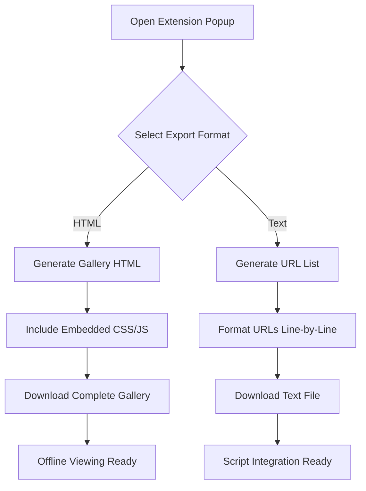
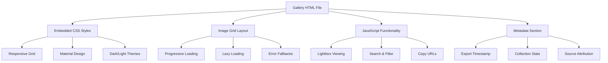
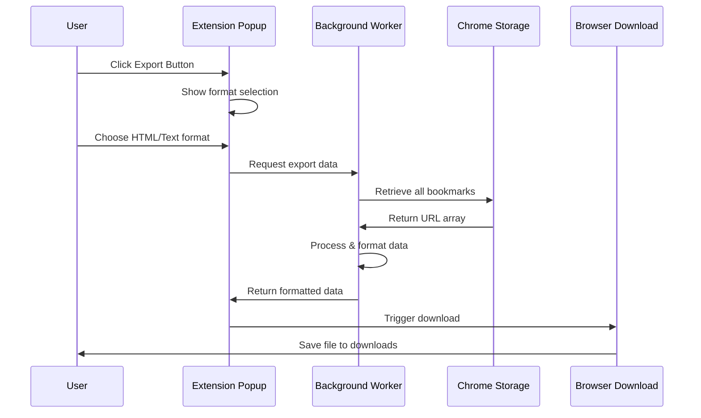

# Gallery Export

Transform your bookmark collection into beautiful, shareable formats with powerful export capabilities designed for both casual users and developers.

<div class="grid cards" markdown>

-   :material-file-code-outline: **HTML Gallery**

    ---

    Self-contained, responsive galleries that work offline. Perfect for portfolios, presentations, and client sharing.

    [:octicons-arrow-right-24: Learn more](#html-gallery-format)

-   :material-format-list-text: **Text Format**

    ---

    Simple URL lists for developers, scripts, and external tool integration. Clean and automation-friendly.

    [:octicons-arrow-right-24: Learn more](#text-format)

</div>

## Export Flow Overview



## HTML Gallery Format

### Gallery Structure

The HTML export creates a complete, self-contained webpage:



### Visual Layout

!!! note "Gallery Preview Coming Soon"
    
    A visual preview of the HTML gallery export will be added here. The gallery features a responsive grid layout with image thumbnails, metadata display, and fullscreen viewing capabilities.

### Key Features

!!! success "Offline Capability"

    **Complete Self-Containment**: All styles, scripts, and structure embedded in a single HTML file. No internet connection required after download.

!!! tip "Responsive Design"

    **Multi-Device Support**: Automatically adapts to desktop, tablet, and mobile screens with Material Design principles.

!!! info "Progressive Loading"

    **Performance Optimized**: Images load as needed with elegant loading states and error handling.

### Generated Gallery Code Structure

=== "HTML Structure"

    ```html
    <!DOCTYPE html>
    <html lang="en">
    <head>
        <meta charset="UTF-8">
        <meta name="viewport" content="width=device-width, initial-scale=1.0">
        <title>Midjourney Collection - Exported {date}</title>
        <style>/* Embedded CSS */</style>
    </head>
    <body>
        <header class="gallery-header">
            <h1>Midjourney Collection</h1>
            <div class="gallery-stats">{count} images • Exported {timestamp}</div>
        </header>
        <main class="gallery-grid">
            <!-- Image cards generated here -->
        </main>
        <script>/* Embedded JavaScript */</script>
    </body>
    </html>
    ```

=== "CSS Highlights"

    ```css
    .gallery-grid {
        display: grid;
        grid-template-columns: repeat(auto-fill, minmax(300px, 1fr));
        gap: 1.5rem;
        padding: 2rem;
    }
    
    .image-card {
        border-radius: 8px;
        overflow: hidden;
        box-shadow: 0 4px 6px rgba(0, 0, 0, 0.1);
        transition: transform 0.3s ease;
    }
    
    .image-card:hover {
        transform: translateY(-4px);
        box-shadow: 0 8px 16px rgba(0, 0, 0, 0.2);
    }
    ```

=== "JavaScript Features"

    ```javascript
    // Lightbox functionality
    function openLightbox(imageUrl) {
        const lightbox = document.getElementById('lightbox');
        const lightboxImg = document.getElementById('lightbox-image');
        lightboxImg.src = imageUrl;
        lightbox.classList.add('active');
    }
    
    // Copy URL functionality
    function copyImageUrl(url) {
        navigator.clipboard.writeText(url);
        showToast('URL copied to clipboard');
    }
    
    // Lazy loading with Intersection Observer
    const imageObserver = new IntersectionObserver(
        (entries, observer) => {
            entries.forEach(entry => {
                if (entry.isIntersecting) {
                    const img = entry.target;
                    img.src = img.dataset.src;
                    observer.unobserve(img);
                }
            });
        }
    );
    ```

## Text Format

### Simple & Developer-Friendly

Perfect for automation, scripts, and external tool integration:

```
https://cdn.midjourney.com/a1b2c3d4-e5f6-7890-abcd-ef1234567890/0_0.jpeg
https://cdn.midjourney.com/f9e8d7c6-b5a4-3210-9876-543210fedcba/0_0.jpeg
https://cdn.midjourney.com/12345678-90ab-cdef-1234-567890abcdef/0_0.jpeg
```

### Use Cases

=== "Batch Processing"

    ```bash
    # Download all images with wget
    wget -i exported_urls.txt
    
    # Process with custom script
    cat exported_urls.txt | while read url; do
        echo "Processing: $url"
        # Your processing logic here
    done
    ```

=== "API Integration"

    ```python
    # Python integration example
    with open('exported_urls.txt', 'r') as file:
        urls = [line.strip() for line in file]
    
    for url in urls:
        # Process each URL
        process_image(url)
    ```

=== "Database Import"

    ```sql
    -- Import into database
    LOAD DATA INFILE 'exported_urls.txt'
    INTO TABLE midjourney_images
    FIELDS TERMINATED BY '\n'
    (image_url);
    ```

## Export Process Workflow

### Step-by-Step Export



### Export Customization Options

!!! example "HTML Gallery Options"

    - **Theme Selection**: Light, dark, or auto-detect
    - **Grid Size**: Compact, standard, or large thumbnails  
    - **Metadata Level**: Minimal, standard, or comprehensive
    - **Loading Style**: Progressive, lazy, or immediate

!!! example "Text Format Options"

    - **URL Format**: Standardized, original, or both
    - **Sorting**: Chronological, alphabetical, or random
    - **Filtering**: Include metadata comments or clean URLs only

## Performance Considerations

### File Size Optimization

| Collection Size | HTML Export | Text Export | Load Time |
|----------------|-------------|-------------|-----------|
| 50 images | ~150KB | ~3KB | <1 second |
| 200 images | ~450KB | ~12KB | ~2 seconds |
| 500 images | ~900KB | ~30KB | ~4 seconds |
| 1000+ images | ~1.5MB | ~60KB | ~6 seconds |

### Browser Compatibility

✅ **Fully Supported**: Chrome 88+, Firefox 85+, Safari 14+, Edge 88+  
✅ **Mobile Optimized**: iOS Safari, Chrome Mobile, Samsung Internet  
✅ **Graceful Degradation**: Older browsers get simplified layout

## Advanced Export Features

### Metadata Preservation

Each export includes comprehensive collection metadata:

```json
{
  "exportMetadata": {
    "timestamp": "2024-09-06T15:30:00Z",
    "version": "1.0.0",
    "totalImages": 247,
    "exportFormat": "html",
    "source": "Midjourney Image Tracker Extension"
  }
}
```

### Export Templates

Future feature preview:

!!! info "Coming Soon"

    **Custom Templates**: Create personalized gallery layouts
    
    **Batch Metadata**: Include creation dates, prompts, and tags
    
    **Cloud Export**: Direct export to Google Drive, Dropbox
    
    **PDF Generation**: Print-ready portfolio formats

## Troubleshooting Exports

### Common Issues & Solutions

??? question "Export button is greyed out"

    **Cause**: No bookmarks in collection  
    **Solution**: Save at least one bookmark before exporting

??? question "HTML gallery images not loading"

    **Cause**: Internet connection required for images  
    **Solution**: Images are hosted on Midjourney's servers - offline viewing requires internet for first load

??? question "Export file is very large"

    **Cause**: Large collection with complex HTML  
    **Solution**: Use text format for large collections (1000+ images) or export in smaller batches

### Export Validation

The extension validates exports before download:

```javascript
// Export validation
function validateExport(data, format) {
    if (!data || data.length === 0) {
        throw new Error('No bookmarks to export');
    }
    
    if (format === 'html' && data.length > 2000) {
        return confirm('Large collection detected. Export may take a moment. Continue?');
    }
    
    return true;
}
```

---

Ready to export your collection? Open the extension popup and click the export button to get started. Your curated Midjourney collection awaits!

[:material-rocket-launch: Try Export Now](../getting-started/quick-start.md#exporting-your-collection){ .md-button .md-button--primary }

[:material-help-circle: Export Troubleshooting](../how-to/troubleshooting.md#export-issues){ .md-button }