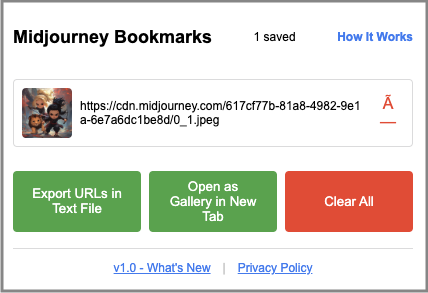

# User Guide

This comprehensive guide covers everything you need to know to use Midjourney Image Tracker effectively, from basic bookmarking to advanced collection management.

## Getting Started

### First Launch

After installing the extension, you'll see the Midjourney Image Tracker icon in your Chrome toolbar. The extension works immediately - no setup or configuration required.

<figure markdown="span">
  { width="300" align="right" }
  <figcaption>Extension popup interface</figcaption>
</figure>

### Your First Bookmark

1. **Visit Midjourney**: Navigate to any page with images on [midjourney.com](https://midjourney.com)
2. **Find an Image**: Browse through available images
3. **Hover to Reveal**: Move your cursor over any image
4. **Click to Save**: Click the bookmark button that appears

!!! tip "Where It Works"
    
    The extension recognizes images on all Midjourney pages:
    
    - **Create**: Your personal generations
    - **Explore**: Trending community images  
    - **Community**: Recent public creations
    - **User Profiles**: Individual creator galleries

## Core Features

### Smart Bookmarking

The extension automatically prevents duplicate bookmarks through intelligent URL recognition:

=== "How It Appears to You"
    - Hover over any image → Bookmark button appears
    - Click to save → Instant confirmation
    - Already bookmarked images show a different button state
    - No duplicate saves, ever

=== "What Happens Behind the Scenes"
    ```
    1. Image URL detected: cdn.midjourney.com/uuid/0_0_640_N.webp
    2. URL standardized: cdn.midjourney.com/uuid/0_0.jpeg  
    3. Duplicate check: Already saved?
    4. Save result: New bookmark or "already saved" message
    ```

### Collection Management

#### Viewing Your Collection

Click the extension icon to open your bookmark manager:

- **Grid View**: Visual thumbnails of all saved images
- **Quick Stats**: Total bookmark count
- **Search & Filter**: Find specific images (coming soon)

#### Individual Bookmark Actions

For each saved bookmark, you can:

- **View Full Size**: Click the thumbnail to open the original image
- **Delete**: Remove individual bookmarks with the "×" button  
- **Copy URL**: Right-click for context menu options

#### Bulk Operations

Manage your entire collection:

- **Export All**: Create downloadable files of your collection
- **Clear All**: Remove all bookmarks (requires confirmation)
- **Select Multiple**: Batch operations (coming soon)

### Export Options

Transform your collection into shareable formats:

<div class="grid cards" markdown>

-   :material-file-code-outline: **HTML Gallery**

    ---

    Self-contained webpage with all your bookmarked images. Perfect for offline viewing and sharing.
    
    **Features:**
    - Responsive grid layout
    - Works without internet
    - Embedded metadata  
    - Professional presentation

-   :material-file-document-outline: **Text Export**

    ---

    Simple list of URLs, one per line. Ideal for developers and automation.
    
    **Features:**
    - Clean, standardized URLs
    - Easy to parse
    - Import into other tools
    - Perfect for scripts

</div>

## Advanced Workflows

### Building Curated Collections

**Mood Board Creation**
: Bookmark images that match a specific theme, color palette, or style. Export as HTML gallery for client presentations.

**Style Research**
: Save examples of interesting AI art techniques. Use text export to analyze URL patterns and generation metadata.

**Project References**
: Collect inspiration for specific projects. The visual gallery makes it easy to review and compare options.

### Sharing and Collaboration

**Client Presentations**
: Export HTML galleries that work offline. Clients can view your curated collections without needing Midjourney access.

**Team Collaboration**  
: Share text exports with team members who can then import URLs into their own systems.

**Portfolio Building**
: Use the visual gallery as a starting point for showcasing AI art collections in your portfolio.

## Tips and Best Practices

### Efficient Bookmarking

!!! tip "Bookmark Smart"

    **Quality over Quantity**: Be selective to maintain a focused collection
    
    **Bookmark While Browsing**: Save images immediately when you find them interesting
    
    **Regular Review**: Periodically review and clean up your collection
    
    **Export Regularly**: Create backups of valuable collections

### Performance Optimization

**Large Collections**: Collections with 1000+ bookmarks may take a moment to load. Consider organizing into multiple themed collections.

**Browsing Performance**: The extension is optimized for smooth browsing, but very active bookmarking sessions may benefit from occasional browser refreshes.

### Privacy and Security

**Local Storage Only**: All bookmarks stay in your browser. No external servers involved.

**No Tracking**: The extension doesn't collect or transmit any usage data.

**Secure by Default**: Only works on Midjourney domains for your protection.

## Understanding Visual Indicators

### Bookmark Button States

| Button State | Meaning | Action Available |
|-------------|---------|------------------|
| **Empty Bookmark** | Not yet saved | Click to bookmark |
| **Filled Bookmark** | Already saved | Click to remove |
| **Loading** | Processing request | Wait for completion |
| **No Button** | Not a Midjourney image | No action available |

### Extension Icon States

| Icon State | Meaning |
|-----------|---------|
| **Normal** | Extension active and working |
| **Grayed Out** | Not on a Midjourney page |
| **Badge Number** | Number of bookmarks (optional) |

## Troubleshooting Common Issues

### Bookmark Button Not Appearing

??? question "Images don't show bookmark buttons"

    **Check the URL**: Only images hosted on `cdn.midjourney.com` will show buttons
    
    **Refresh the page**: Sometimes dynamic content needs a refresh
    
    **Check extension**: Ensure the extension is enabled in `chrome://extensions/`

??? question "Button appears but doesn't work"

    **Extension context**: Try refreshing the page to restore extension connection
    
    **Check permissions**: Verify the extension has access to Midjourney domains
    
    **Browser restart**: Sometimes Chrome needs a restart after extension updates

### Collection Issues

??? question "Bookmarks not saving"

    **Storage space**: Check if you're approaching Chrome's storage limits
    
    **Browser sync**: If using Chrome sync, data might be syncing slowly
    
    **Extension updates**: Recent updates might require clearing and re-saving

??? question "Missing bookmarks"

    **Browser data**: Check if browser data was cleared recently
    
    **Different profiles**: Ensure you're using the same Chrome profile
    
    **Export history**: Check if you have exported backups

### Export Problems

??? question "HTML gallery doesn't work"

    **File location**: Ensure the exported file wasn't moved after creation
    
    **Browser security**: Some browsers restrict local HTML files - try Firefox or Safari
    
    **File corruption**: Re-export if the file seems damaged

??? question "Text export is empty"

    **Collection size**: Empty collections produce empty exports
    
    **File format**: Ensure your text editor supports UTF-8 encoding
    
    **Line endings**: Different operating systems may display line endings differently

## Keyboard Shortcuts

While the extension primarily uses hover and click interactions, these browser shortcuts are helpful:

| Shortcut | Action |
|----------|--------|
| `Ctrl/Cmd + Click` | Open bookmark in new tab |
| `Right Click` | Context menu options |
| `Alt + Left/Right` | Navigate browser history |
| `F5` | Refresh page (helpful if extension seems stuck) |

## Data Management

### Storage Locations

Your bookmarks are stored in Chrome's local storage:

- **Location**: Browser profile data directory
- **Format**: JSON with standardized URLs
- **Sync**: Syncs with Chrome account if browser sync is enabled
- **Backup**: Only through export functionality

### Migration and Backup

**Regular Backups**: Export your collection regularly as both HTML and text formats

**Browser Changes**: If switching browsers, export text format for easier import into new systems

**System Changes**: Before major system updates, export your collection as backup

**Sharing Across Devices**: Chrome sync will sync bookmarks if enabled in browser settings

## Getting Help

### Self-Service Resources

- **[Quick Start Guide](quick-start.md)**: 2-minute introduction to basic features
- **[Installation Guide](installation.md)**: Setup and troubleshooting installation issues  
- **[Troubleshooting](../how-to/troubleshooting.md)**: Common problems and solutions

### Community Support

- **GitHub Issues**: Report bugs or request features at [github.com/dagny099/mj-extension](https://github.com/dagny099/mj-extension)
- **Discussions**: Share tips and ask questions in GitHub Discussions

### Feature Requests

Have an idea for improvement? We welcome suggestions:

1. Check existing issues to avoid duplicates
2. Open a new feature request with detailed description
3. Explain your use case and expected behavior
4. Add mockups or examples if helpful

---

This guide covers the core functionality to get you started. As you become more familiar with the extension, you'll discover additional workflows that fit your specific needs for collecting and organizing AI-generated artwork.