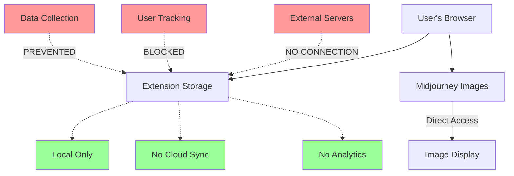
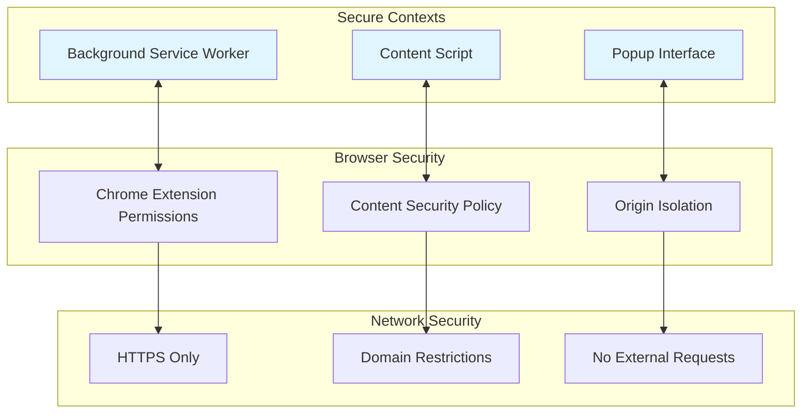
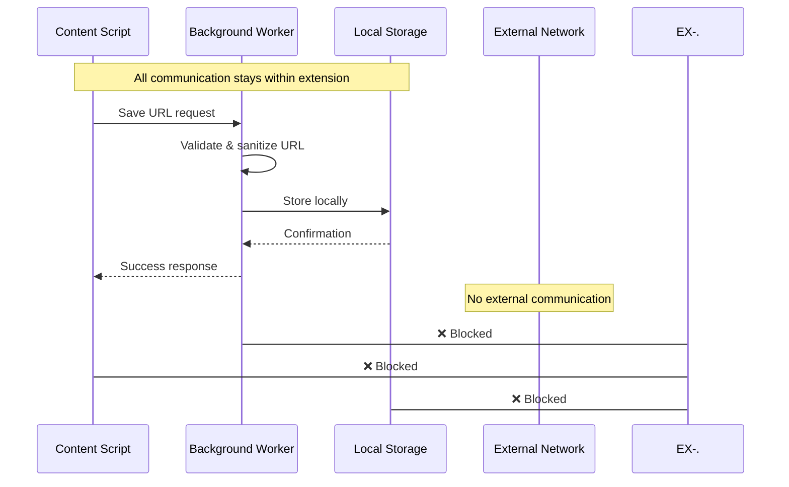
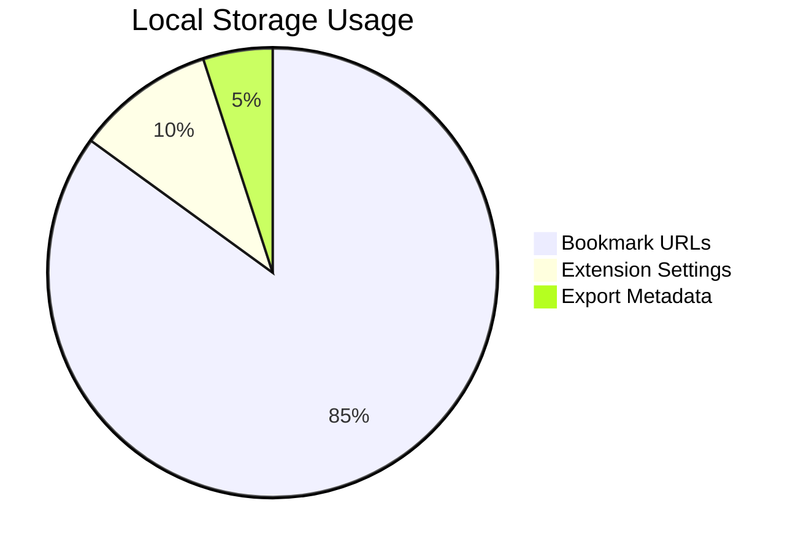
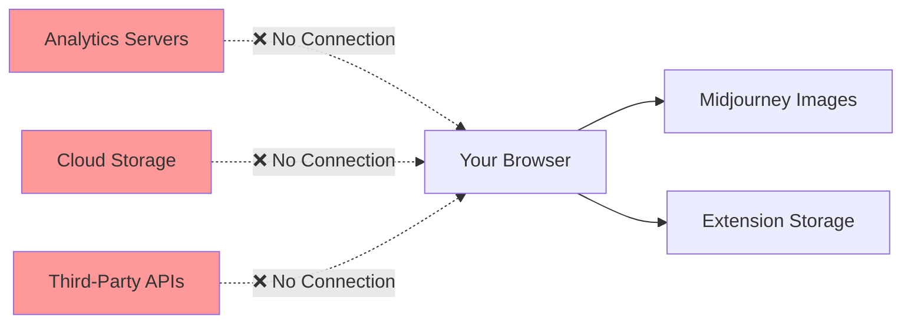

# Privacy & Security

Complete privacy protection with local-first architecture and zero-trust principles. Your data stays yours.

!!! success "Privacy Guarantee"

    **Zero external data transmission**. All bookmark data remains in your local browser storage. No servers, no accounts, no tracking.

## Privacy Architecture



## What We Store vs. What We Don't

### ✅ Data We Store (Locally Only)

<div class="grid cards" markdown>

-   :material-bookmark-outline: **Bookmark URLs Only**

    ---
    
    Standardized Midjourney image URLs in your local Chrome storage. Nothing else.
    
    ```
    https://cdn.midjourney.com/uuid/0_0.jpeg
    ```

-   :material-clock-outline: **Export Timestamps**

    ---
    
    Simple timestamps for when you export collections. Used for file naming only.

-   :material-cog-outline: **Extension Preferences**

    ---
    
    UI settings like theme preferences. Stored locally in Chrome storage.

</div>

### ❌ Data We DON'T Store

!!! danger "Never Collected"

    **Personal Information**: No names, emails, accounts, or profiles  
    **Browsing History**: No tracking of your web activity  
    **Image Content**: No copies of actual images stored  
    **Usage Analytics**: No telemetry, metrics, or behavior tracking  
    **Metadata**: No creation dates, prompts, or Midjourney account info  
    **Cross-Site Data**: Only active on Midjourney domains

## Security Architecture

### Chrome Extension Security Model



### Minimal Permission Model

The extension requests only essential permissions:

```json
{
  "permissions": [
    "activeTab",    // Access current tab when popup opened
    "storage",      // Local bookmark storage only
    "downloads",    // Export functionality
    "tabs"          // Tab management for exports only
  ],
  "host_permissions": [
    "https://*.midjourney.com/*"  // Midjourney domains only
  ]
}
```

!!! info "Permission Transparency"

    **activeTab**: Only accesses the current tab when you click the extension icon  
    **storage**: Chrome's local storage API - never synchronized externally  
    **downloads**: Required for exporting your collection as files  
    **tabs**: Only for opening exported galleries in new tabs  
    **host_permissions**: Restricts operation to Midjourney domains only

### Content Security Policy Protection

```javascript
// Strict CSP prevents code injection
{
  "content_security_policy": {
    "extension_pages": "script-src 'self'; object-src 'self';"
  }
}
```

**Protection Against**:
- Script injection attacks
- Cross-site scripting (XSS) 
- Malicious code execution
- Unauthorized network requests

## Data Flow Security

### Secure Message Passing

All internal communication uses Chrome's secure message passing:



### URL Validation & Sanitization

Every URL is validated before processing:

```javascript
function validateAndSanitizeUrl(url) {
  try {
    const parsed = new URL(url);
    
    // Security checks
    if (parsed.protocol !== 'https:') {
      throw new Error('Only HTTPS URLs allowed');
    }
    
    if (!parsed.hostname.includes('midjourney.com')) {
      throw new Error('Only Midjourney URLs allowed');
    }
    
    // Additional validation...
    return parsed.href;
  } catch (error) {
    console.warn('URL validation failed:', error.message);
    return null;
  }
}
```

## Privacy Compliance

### GDPR Compliance

<div class="grid cards" markdown>

-   :material-shield-check-outline: **Data Minimization**

    ---
    
    Only collects URLs necessary for bookmarking functionality. No personal data.

-   :material-account-remove-outline: **No Profiling**

    ---
    
    Zero user profiling, behavioral tracking, or automated decision making.

-   :material-delete-outline: **Right to Deletion**

    ---
    
    Users control all data. Clear bookmarks anytime through the interface.

-   :material-lock-outline: **Data Protection**

    ---
    
    Local-only storage ensures data never leaves user's control.

</div>

### California Privacy Rights (CCPA)

!!! success "Full Compliance"

    **Right to Know**: Extension stores only bookmark URLs locally  
    **Right to Delete**: Users can clear all data through the interface  
    **Right to Opt-Out**: No data collection to opt out from  
    **No Sale of Data**: Impossible - no data transmission occurs

### Children's Privacy (COPPA)

Safe for all ages - no data collection means no privacy concerns for any user demographic.

## Security Best Practices for Users

### Extension Security Hygiene

!!! tip "Regular Security Maintenance"

    **Keep Updated**: Enable automatic Chrome extension updates  
    **Review Permissions**: Periodically check what permissions extensions have  
    **Monitor Behavior**: Be aware of unusual browser behavior  
    **Source Verification**: Only install from official Chrome Web Store

### Storage Management



**Storage Limits**: Chrome's 5MB local storage limit provides natural data boundaries

**Cleanup Options**:
- Clear individual bookmarks
- Clear entire collection  
- Extension uninstall removes all data

### Network Security

The extension operates with zero network footprint:



## Threat Model Analysis

### What We Protect Against

| Threat | Protection Method | Risk Level |
|--------|------------------|------------|
| **Data Interception** | Local-only storage | ✅ Eliminated |
| **User Tracking** | Zero telemetry | ✅ Eliminated |
| **Account Compromise** | No accounts required | ✅ Eliminated |
| **Data Breaches** | No servers to breach | ✅ Eliminated |
| **Script Injection** | Strict CSP policy | ✅ Protected |
| **Permission Abuse** | Minimal permissions | ✅ Mitigated |

### Attack Surface Minimization

**Traditional Extension Risks**:
- Server-side vulnerabilities ❌ Not applicable (no servers)
- Network interception ❌ Not applicable (no network requests)
- Account database breaches ❌ Not applicable (no accounts)
- Third-party API risks ❌ Not applicable (no external APIs)

**Our Attack Surface**:
- Local Chrome storage only ✅ Minimal risk
- Standard extension permissions ✅ Auditable
- Open source code ✅ Transparent

## Audit & Verification

### Code Transparency

!!! info "Open Source Verification"

    **Full Code Availability**: [GitHub Repository](https://github.com/dagny099/mj-extension)  
    **No Obfuscation**: All code readable and auditable  
    **MIT License**: Open source licensing for community review

### Self-Audit Checklist

Users can verify privacy claims:

=== "Data Storage Check"

    1. Open Chrome DevTools on any Midjourney page
    2. Go to Application → Storage → Extension Storage
    3. Verify only bookmark URLs present
    4. No personal data, tracking IDs, or analytics

=== "Network Activity Check"

    1. Open Chrome DevTools → Network tab
    2. Use extension normally (hover, bookmark, export)
    3. Verify zero network requests from extension
    4. Only direct image requests to Midjourney

=== "Permission Audit"

    1. Visit `chrome://extensions/`
    2. Click extension details
    3. Review "Permissions" section
    4. Verify minimal, justified permissions only

## Privacy Questions & Answers

??? question "Can Midjourney see what I bookmark?"

    **No.** The extension stores URLs locally in your browser. Midjourney has no visibility into what you bookmark or your extension activity.

??? question "Does the extension track my browsing?"

    **No.** The extension only activates on Midjourney pages and stores no browsing history or behavioral data.

??? question "What happens to my data if I uninstall?"

    **Complete removal.** All bookmark data is deleted when you uninstall the extension. No cloud backup or remote storage exists.

??? question "Can other extensions access my bookmarks?"

    **No.** Chrome isolates extension storage. Other extensions cannot access this extension's data.

??? question "Is my data synchronized across devices?"

    **No.** All data stays on the local device. No synchronization, cloud storage, or cross-device features.

---

## Trust Verification

Want to verify these claims? The extension is fully open source:

[:material-github: Audit Source Code](https://github.com/dagny099/mj-extension){ .md-button .md-button--primary }

[:material-shield-check: Review Security](https://github.com/dagny099/mj-extension/security){ .md-button }

**Privacy by design, security by default, trust through transparency.**