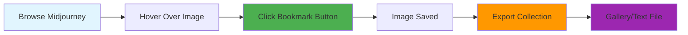

# Midjourney Image Tracker

-   :octicons-bookmark-24: **Smart Bookmarking**

    ---

    Effortlessly save your favorite Midjourney AI-generated artwork with intelligent duplicate detection and URL standardization.

    [:octicons-arrow-right-24: Learn more](features/bookmarking.md)

-   :octicons-image-24: **Visual Gallery**

    ---

    View your collection in a beautiful, organized gallery that works offline. Export to HTML or share as text.

    [:octicons-arrow-right-24: View gallery features](features/gallery-export.md)

-   :fontawesome-solid-hand-pointer: **Hover to Save**

    ---

    Simply hover over any Midjourney image to reveal the bookmark button. No complex menus or interruptions.

    [:octicons-arrow-right-24: See how it works](getting-started/user-guide.md)

-   :octicons-shield-24: **Privacy First**

    ---

    All data stays local in your browser. No external servers, no tracking, complete privacy protection.

    [:octicons-arrow-right-24: Privacy details](how-to/privacy-security.md)

## What is Midjourney Image Tracker?

Midjourney Image Tracker is a lightweight Chrome extension that transforms how you collect and organize AI-generated artwork from Midjourney. Whether you're a designer building a mood board, an artist collecting inspiration, or simply someone who loves beautiful AI art, this extension makes it effortless to build your personal collection.

!!! tip "Quick Start"
    
    New to the extension? Check out our **[project README](https://github.com/dagny099/mj-extension#readme)** for a quick overview and installation instructions, or jump straight to our [Quick Start Guide](getting-started/quick-start.md).

Simple workflow: Browse → Hover → Bookmark → Export

## Key Highlights

!!! success "Smart & Efficient"

    **URL Standardization Technology** automatically prevents duplicate bookmarks by recognizing when different URL formats point to the same image. Save thumbnail versions, full-size images, or grid previews - they're all intelligently consolidated.

!!! tip "Zero Setup Required"

    Install and start bookmarking immediately. No accounts, no configuration, no learning curve. The extension works seamlessly across all Midjourney pages.

!!! info "Export Freedom"

    Your collection belongs to you. Export as a standalone HTML gallery for offline viewing, or as a simple text file for sharing and backup.

## Perfect For

=== "Digital Artists"

    Build comprehensive mood boards and reference collections. The visual gallery makes it easy to browse through saved artwork for inspiration.

=== "Designers"

    Collect design patterns, color schemes, and creative concepts. Export galleries to share with clients or team members.

=== "AI Enthusiasts"

    Organize your favorite generations and track trending styles. Perfect for anyone exploring AI art creation.

=== "Researchers"

    Document AI art evolution and collect examples for academic or commercial research projects.

## Getting Started

Ready to transform your Midjourney experience? Get started in minutes:

### :octicons-download-24: Install Extension

[:octicons-browser-24: Install from Chrome Web Store](#){ .md-button .md-button--primary }

*Coming soon to Chrome Web Store*

[:octicons-mark-github-16: Install from GitHub](getting-started/installation.md#developer-installation){ .md-button }

### :octicons-play-24: Quick Start

New to the extension? Our quick start guide gets you bookmarking in 2 minutes.

[:octicons-rocket-24: Quick Start Guide](getting-started/quick-start.md){ .md-button }

## Technical Excellence

Built with modern web technologies and best practices for performance and security:

- **Manifest V3 Architecture** - Latest Chrome extension standards
- **Minimal Permissions** - Only requests access to Midjourney domains
- **Performance Optimized** - Debounced interactions and smart caching
- **Memory Efficient** - Lightweight design with minimal resource usage

-   :octicons-code-24: **For Developers**

    ---

    Explore the technical architecture, contribute to development, or integrate with your own tools.

    [:octicons-arrow-right-24: Technical Documentation](technical/architecture.md)
    
    [:octicons-arrow-right-24: Development Guide](development/setup.md)

-   :octicons-question-24: **Need Help?**

    ---

    Find answers to common questions, troubleshooting tips, and detailed usage guides.

    [:octicons-arrow-right-24: User Guide](getting-started/user-guide.md)
    
    [:octicons-arrow-right-24: Troubleshooting](how-to/troubleshooting.md)

---

About This Project

This extension was created by **[Barbara HS](https://linkedin.com/in/barbara-sichau)** ([@dagny099](https://github.com/dagny099)) as part of a data science portfolio project. It demonstrates modern Chrome extension development, smart URL handling, and user-centered design principles.

The project is open source and available on [GitHub :octicons-mark-github-16:](https://github.com/dagny099/mj-extension) under the MIT License.

