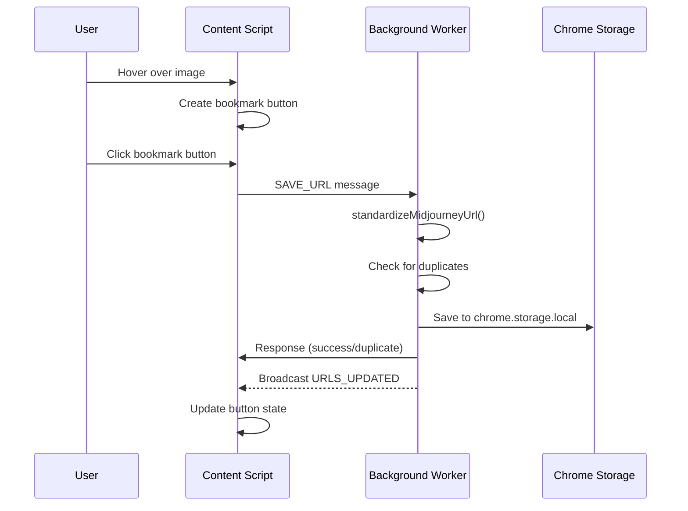
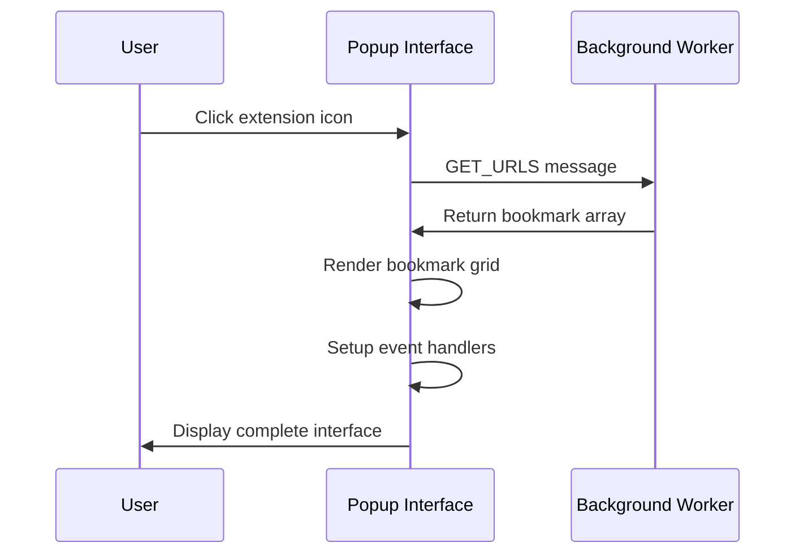

# API Reference

The Midjourney Image Tracker uses Chrome's message passing system for internal communication between extension contexts. This reference documents all available message types, their parameters, and expected responses.

!!! info "Internal API Only"
    
    This API is for internal extension communication, not external integrations. All communication happens within the Chrome extension security context.

## Message Architecture

### Request Structure

All messages follow a consistent JSON structure:

```typescript
interface Message {
  type: string;           // Required: Message type identifier
  [key: string]: any;     // Optional: Message-specific properties
}
```

### Response Structure  

Standard response format for all operations:

```typescript
interface Response {
  success: boolean;       // Required: Operation success status
  data?: any;            // Optional: Response payload
  message?: string;      // Optional: Human-readable message  
  error?: string;        // Optional: Error description
}
```

## Core Messages

### URL Management API

<div class="api-method">
<span class="method-name">SAVE_URL</span>
</div>

Saves a Midjourney image URL to the bookmark collection with automatic duplicate prevention.

**Parameters:**
```javascript
{
  type: 'SAVE_URL',
  url: string             // Midjourney image URL to bookmark
}
```

**Response:**
```javascript
{
  success: boolean,       // true if saved, false if duplicate
  message?: string        // 'URL already saved' for duplicates
}
```

**Example Usage:**
=== "Content Script"
    ```javascript
    // Save bookmark from content script
    chrome.runtime.sendMessage({
      type: 'SAVE_URL',
      url: 'https://cdn.midjourney.com/abc123.../0_0.png'
    }, (response) => {
      if (response.success) {
        showSuccessIndicator();
      } else {
        showDuplicateMessage();
      }
    });
    ```

=== "Implementation Details"
    - URL is automatically standardized using `shared.js:standardizeMidjourneyUrl()`
    - Duplicate detection uses Set-based O(1) lookup
    - Triggers `URLS_UPDATED` broadcast to active content scripts
    - Persists to `chrome.storage.local` for persistence across browser sessions

---

<div class="api-method">
<span class="method-name">GET_URLS</span>
</div>

Retrieves all saved bookmark URLs from storage.

**Parameters:**
```javascript
{
  type: 'GET_URLS'
}
```

**Response:**
```javascript
{
  success: true,
  urls: string[]          // Array of standardized bookmark URLs
}
```

**Example Usage:**
=== "Popup Interface"
    ```javascript
    // Load bookmarks in popup
    chrome.runtime.sendMessage({ type: 'GET_URLS' }, (response) => {
      const bookmarks = response.urls || [];
      renderBookmarkGrid(bookmarks);
      updateBookmarkCount(bookmarks.length);
    });
    ```

=== "Content Script"
    ```javascript
    // Update bookmark button states
    chrome.runtime.sendMessage({ type: 'GET_URLS' }, (response) => {
      savedUrlsCache = new Set(response.urls);
      updateAllBookmarkButtons();
    });
    ```

---

<div class="api-method">
<span class="method-name">DELETE_URL</span>
</div>

Removes a specific URL from the bookmark collection.

**Parameters:**
```javascript
{
  type: 'DELETE_URL', 
  url: string             // URL to remove (automatically standardized)
}
```

**Response:**
```javascript
{
  success: boolean,       // true if deleted, false if not found
  message?: string        // Error message if deletion failed
}
```

**Example Usage:**
```javascript
// Delete bookmark from popup
chrome.runtime.sendMessage({
  type: 'DELETE_URL',
  url: bookmarkUrl
}, (response) => {
  if (response.success) {
    removeBookmarkFromUI(bookmarkUrl);
    showToast('Bookmark removed');
  }
});
```

---

<div class="api-method">
<span class="method-name">CLEAR_ALL_URLS</span>
</div>

Removes all bookmarks from storage (destructive operation).

**Parameters:**
```javascript
{
  type: 'CLEAR_ALL_URLS'
}
```

**Response:**
```javascript
{
  success: boolean,
  message: string         // Confirmation message
}
```

**Example Usage:**
```javascript
// Clear all bookmarks (after user confirmation)
if (confirm('Delete all bookmarks? This cannot be undone.')) {
  chrome.runtime.sendMessage({ type: 'CLEAR_ALL_URLS' }, (response) => {
    if (response.success) {
      location.reload();
    }
  });
}
```

### System Messages

<div class="api-method">
<span class="method-name">URLS_UPDATED</span>
</div>

Broadcast message sent to content scripts when bookmark data changes (no response expected).

**Parameters:**
```javascript
{
  type: 'URLS_UPDATED'
}
```

**Listener Setup:**
```javascript
// Content script listener
chrome.runtime.onMessage.addListener((message, sender, sendResponse) => {
  if (message.type === 'URLS_UPDATED') {
    // Invalidate cache and refresh UI
    refreshBookmarkButtonStates();
  }
});
```

**Triggered When:**
- Successful `SAVE_URL` operation
- Successful `DELETE_URL` operation
- `CLEAR_ALL_URLS` operation completed

---

<div class="api-method">
<span class="method-name">GET_EXTENSION_INFO</span>
</div>

Retrieves extension metadata and system information.

**Parameters:**
```javascript
{
  type: 'GET_EXTENSION_INFO'
}
```

**Response:**
```javascript
{
  success: true,
  data: {
    version: string,        // Extension version from manifest.json
    name: string,           // Extension name
    permissions: string[],  // Active permissions
    storageUsed: number     // Bytes used in chrome.storage.local
  }
}
```

## Message Flow Patterns

### Complete Bookmark Creation Flow



### Popup Loading Flow



## Error Handling Patterns

### Runtime Connection Errors

```javascript
function sendMessageSafely(message, callback) {
  if (!chrome.runtime?.id) {
    console.warn('Extension context invalidated');
    return callback({ success: false, error: 'Context invalid' });
  }

  chrome.runtime.sendMessage(message, (response) => {
    if (chrome.runtime.lastError) {
      console.error('Message failed:', chrome.runtime.lastError.message);
      callback({ success: false, error: chrome.runtime.lastError.message });
      return;
    }
    
    callback(response);
  });
}
```

### Timeout Handling

```javascript
function sendMessageWithTimeout(message, timeoutMs = 5000) {
  return new Promise((resolve, reject) => {
    const timeoutId = setTimeout(() => {
      reject(new Error('Message timeout'));
    }, timeoutMs);

    sendMessageSafely(message, (response) => {
      clearTimeout(timeoutId);
      resolve(response);
    });
  });
}
```

### Context Validation

```javascript
// Check if extension context is still valid
function isExtensionContextValid() {
  try {
    chrome.runtime.getURL('');
    return true;
  } catch (e) {
    return false;
  }
}

// Use before sending messages
if (!isExtensionContextValid()) {
  console.warn('Extension context invalid - skipping message');
  return;
}
```

## Advanced Usage Patterns

### Batched Operations

```javascript
// Save multiple URLs efficiently
async function saveMultipleUrls(urls) {
  const savePromises = urls.map(url => 
    sendMessageWithTimeout({ type: 'SAVE_URL', url })
  );
  
  const results = await Promise.allSettled(savePromises);
  const successful = results.filter(r => r.status === 'fulfilled' && r.value.success);
  
  console.log(`Saved ${successful.length}/${urls.length} bookmarks`);
  return successful.length;
}
```

### Reactive UI Updates

```javascript
// Auto-sync UI state with bookmark changes
class BookmarkUI {
  constructor() {
    this.cache = new Set();
    this.setupMessageListener();
  }
  
  setupMessageListener() {
    chrome.runtime.onMessage.addListener((message) => {
      if (message.type === 'URLS_UPDATED') {
        this.refreshFromStorage();
      }
    });
  }
  
  async refreshFromStorage() {
    const response = await sendMessageWithTimeout({ type: 'GET_URLS' });
    this.cache = new Set(response.urls);
    this.updateAllButtons();
  }
  
  updateAllButtons() {
    document.querySelectorAll('.mj-bookmark-btn').forEach(btn => {
      const url = btn.dataset.url;
      const isBookmarked = this.cache.has(standardizeMidjourneyUrl(url));
      btn.classList.toggle('bookmarked', isBookmarked);
    });
  }
}
```

### Storage Quota Monitoring

```javascript
// Monitor and warn about storage limits
async function checkStorageUsage() {
  const response = await sendMessageWithTimeout({ type: 'GET_EXTENSION_INFO' });
  const { storageUsed } = response.data;
  
  const maxStorage = 5 * 1024 * 1024; // Chrome's 5MB limit
  const usagePercent = (storageUsed / maxStorage) * 100;
  
  if (usagePercent > 80) {
    console.warn(`Storage ${usagePercent.toFixed(1)}% full (${storageUsed} bytes)`);
    showStorageWarning();
  }
}
```

## Testing & Debugging

### Message Inspection

Enable comprehensive logging for development:

```javascript
// Background script: Log all message traffic
chrome.runtime.onMessage.addListener((message, sender, sendResponse) => {
  const senderInfo = sender.tab ? 
    `content script (tab ${sender.tab.id})` : 
    'popup/options page';
    
  console.log(`📨 Message from ${senderInfo}:`, {
    type: message.type,
    payload: message,
    timestamp: Date.now()
  });
  
  // ... handle message ...
  
  console.log(`📤 Response:`, response);
  sendResponse(response);
});
```

### Performance Benchmarking

```javascript
// Measure message handling performance
function benchmarkMessage(messageType, iterations = 100) {
  console.time(`${messageType} x${iterations}`);
  
  let completed = 0;
  const startTime = performance.now();
  
  for (let i = 0; i < iterations; i++) {
    chrome.runtime.sendMessage({ type: messageType }, () => {
      if (++completed === iterations) {
        const duration = performance.now() - startTime;
        console.timeEnd(`${messageType} x${iterations}`);
        console.log(`Average: ${(duration/iterations).toFixed(2)}ms per message`);
      }
    });
  }
}

// Usage
benchmarkMessage('GET_URLS', 50);
```

### Mock Testing

```javascript
// Test message handlers without full extension context
class MockMessageAPI {
  constructor() {
    this.storage = new Set();
  }
  
  async sendMessage(message) {
    switch (message.type) {
      case 'SAVE_URL':
        const standardized = standardizeMidjourneyUrl(message.url);
        if (this.storage.has(standardized)) {
          return { success: false, message: 'URL already saved' };
        }
        this.storage.add(standardized);
        return { success: true };
        
      case 'GET_URLS':
        return { success: true, urls: Array.from(this.storage) };
        
      default:
        throw new Error(`Unknown message type: ${message.type}`);
    }
  }
}

// Usage in tests
const mockAPI = new MockMessageAPI();
const response = await mockAPI.sendMessage({ type: 'SAVE_URL', url: testUrl });
console.assert(response.success, 'Should save new URL');
```

## Security Considerations

### Input Validation

```javascript
// Background script: Validate all incoming messages
function validateMessage(message) {
  if (!message || typeof message.type !== 'string') {
    return { valid: false, error: 'Invalid message structure' };
  }
  
  switch (message.type) {
    case 'SAVE_URL':
    case 'DELETE_URL':
      if (typeof message.url !== 'string' || !message.url.trim()) {
        return { valid: false, error: 'URL required' };
      }
      if (!isMidjourneyImage(message.url)) {
        return { valid: false, error: 'Not a Midjourney URL' };
      }
      break;
      
    case 'GET_URLS':
    case 'CLEAR_ALL_URLS':
    case 'GET_EXTENSION_INFO':
      // No additional validation needed
      break;
      
    default:
      return { valid: false, error: 'Unknown message type' };
  }
  
  return { valid: true };
}

// Use in message handler
chrome.runtime.onMessage.addListener((message, sender, sendResponse) => {
  const validation = validateMessage(message);
  if (!validation.valid) {
    sendResponse({ success: false, error: validation.error });
    return;
  }
  
  // Process valid message...
});
```

### URL Sanitization

```javascript
// Ensure URLs are safe before processing
function sanitizeUrl(url) {
  try {
    const parsed = new URL(url);
    
    // Only allow HTTPS for security
    if (parsed.protocol !== 'https:') {
      throw new Error('Only HTTPS URLs allowed');
    }
    
    // Verify Midjourney domain
    if (!parsed.hostname.includes('midjourney.com')) {
      throw new Error('Only Midjourney URLs allowed');
    }
    
    return parsed.href;
  } catch (error) {
    console.warn('URL sanitization failed:', error.message);
    return null;
  }
}
```

This API provides a robust, secure foundation for extension communication while maintaining excellent performance and user experience.