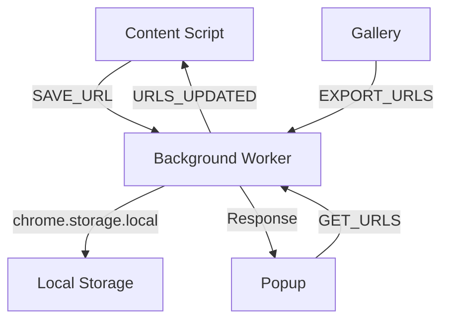
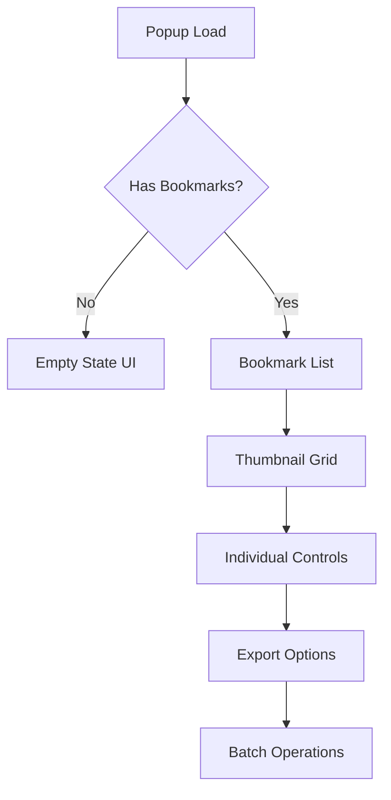
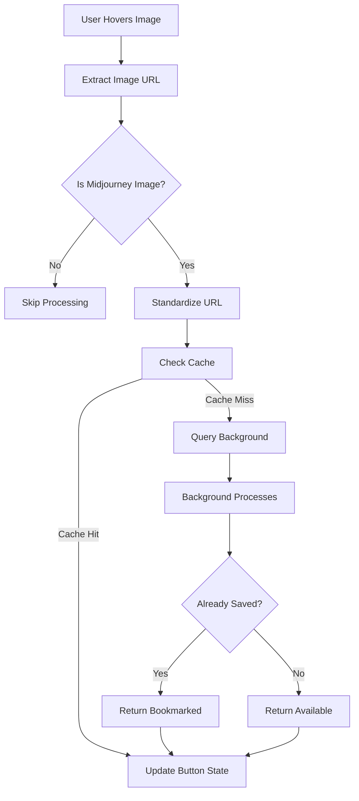

# System Architecture

The Midjourney Image Tracker is built using Chrome Extension Manifest V3 architecture, designed for performance, security, and maintainability. This document provides a comprehensive overview of the system design.

## Architectural Overview

<figure markdown="span">
  { width="800" }
  <figcaption>Complete system architecture showing component interactions and data flow</figcaption>
</figure>

The extension follows a distributed architecture with four main components communicating through Chrome's message passing system.

## Core Components

### 1. Background Service Worker

**File:** `src/js/background.js`  
**Type:** Service Worker (Manifest V3)  
**Lifecycle:** Event-driven, persistent storage handler

The background service worker serves as the central data hub and message coordinator.



**Key Responsibilities:**

- **Message Hub**: Routes messages between content scripts, popup, and gallery
- **Data Persistence**: Manages `chrome.storage.local` operations
- **URL Standardization**: Processes URLs through `standardizeMidjourneyUrl()`
- **Duplicate Prevention**: Maintains URL deduplication using Set data structure
- **Cache Invalidation**: Broadcasts updates to content scripts

**Storage Architecture:** {#storage-architecture}
```javascript
// Internal: Set for O(1) duplicate detection
const savedUrls = new Set();

// Persistence: Array for Chrome storage compatibility  
chrome.storage.local.set({ 'savedUrls': Array.from(savedUrls) });
```

### 2. Content Script System {#content-script-system}

**File:** `src/js/content.js`  
**Type:** Content Script  
**Injection:** `document_end` on `*.midjourney.com`

The content script provides seamless integration with Midjourney's web interface.

**Performance Architecture:**

=== "Hover Detection"
    ```javascript
    // Debounced hover events (200ms)
    const debouncedHover = debounce(handleImageHover, 200);
    
    // MutationObserver for dynamic content
    const observer = new MutationObserver(
        debounce(processNewImages, 300)
    );
    ```

=== "Caching Layer"
    ```javascript
    // Local cache with TTL
    const urlCache = {
        urls: new Set(),
        timestamp: 0,
        TTL: 5000 // 5 seconds
    };
    
    function getCachedUrls() {
        if (Date.now() - urlCache.timestamp > urlCache.TTL) {
            return refreshCache();
        }
        return urlCache.urls;
    }
    ```

=== "Button Management"
    ```javascript
    // Lazy button creation
    function createBookmarkButton(imageElement) {
        if (imageElement.dataset.mjProcessed) return;
        
        const button = document.createElement('button');
        button.className = 'mj-bookmark-btn';
        button.setAttribute('data-mj-processed', 'true');
        
        return button;
    }
    ```

**Features:**

- **Smart Detection**: Identifies Midjourney images using URL pattern matching
- **Hover UI**: Creates bookmark buttons on demand
- **Performance Optimized**: Debounced events and intelligent caching
- **Context Recovery**: Handles extension context invalidation gracefully

### 3. Popup Interface

**Files:** `popup.html`, `src/js/popup.js`  
**Type:** Extension Popup  
**Dimensions:** 350px × 500px (responsive)

The popup serves as the primary user interface for bookmark management.

**UI Architecture:**



**Component Features:**

- **Responsive Grid**: Adaptive thumbnail layout
- **Individual Controls**: Per-bookmark view/delete actions
- **Export System**: HTML gallery and text file generation
- **Batch Operations**: Select all, clear all functionality
- **Real-time Updates**: Live sync with background storage

### 4. Gallery System

**Files:** `gallery.html`, `src/js/gallery.js`  
**Type:** Web Accessible Resource  
**Export Format:** Standalone HTML

The gallery provides a full-screen viewing experience for exported collections.

**Export Architecture:**

```javascript
// Gallery HTML generation
const galleryTemplate = `
<!DOCTYPE html>
<html>
<head>
    <meta charset="utf-8">
    <title>Midjourney Collection</title>
    <style>${galleryCSS}</style>
</head>
<body>
    <div class="gallery-grid">
        ${imageCards.join('')}
    </div>
    <script>${galleryJS}</script>
</body>
</html>`;
```

**Features:**

- **Offline Capable**: Self-contained HTML files
- **Responsive Design**: Mobile and desktop optimized
- **Image Loading**: Progressive loading with fallbacks
- **Metadata Display**: Export timestamp and collection stats

## Data Flow Architecture

### URL Processing Pipeline

The extension uses a sophisticated URL processing system to ensure data quality:



### Message Passing System

Chrome extension contexts communicate through a well-defined message API:

**API Specification:**

| Message Type | Sender | Receiver | Payload | Response |
|-------------|---------|-----------|---------|-----------|
| `SAVE_URL` | Content | Background | `{url: string}` | `{success: boolean}` |
| `GET_URLS` | Content/Popup | Background | `{}` | `{urls: string[]}` |
| `DELETE_URL` | Popup | Background | `{url: string}` | `{success: boolean}` |
| `CLEAR_URLS` | Popup | Background | `{}` | `{success: boolean}` |
| `EXPORT_URLS` | Popup | Background | `{format: string}` | `{data: any}` |
| `URLS_UPDATED` | Background | Content | `{}` | Broadcast |

## Security Architecture

### Permission Model

The extension follows the principle of least privilege:

```json
{
  "permissions": [
    "activeTab",    // Access current tab when icon clicked
    "storage",      // Local bookmark persistence  
    "downloads",    // Export functionality
    "tabs"          // Tab management for exports
  ],
  "host_permissions": [
    "https://*.midjourney.com/*"  // Midjourney domains only
  ]
}
```

### Content Security Policy

```json
{
  "content_security_policy": {
    "extension_pages": "script-src 'self'; object-src 'self'; font-src 'self' data:;"
  }
}
```

**Security Features:**

- **Domain Restriction**: Only operates on Midjourney domains
- **Local Storage**: No external servers or data transmission
- **CSP Protection**: Prevents script injection attacks
- **Minimal Permissions**: Only requests necessary capabilities

### Privacy Protection

- **No Tracking**: Zero user analytics or telemetry
- **Local Only**: All data stays in browser storage
- **No Authentication**: No user accounts or login required
- **Transparent**: Open source with auditable code

## Performance Architecture {#performance-metrics}

### Optimization Strategies

**Memory Management:**
```javascript
// Efficient Set operations for large collections
const urlSet = new Set(); // O(1) lookups
const urlArray = Array.from(urlSet); // Storage conversion
```

**DOM Performance:**
```javascript
// Lazy element creation
function createButtonIfNeeded(image) {
    return image.querySelector('.mj-bookmark-btn') || 
           createNewButton(image);
}

// Debounced mutations
const observer = new MutationObserver(
    debounce(processChanges, 300)
);
```

**Network Efficiency:**
- Intelligent caching reduces API calls
- Batch operations for multiple bookmarks  
- Progressive loading for large galleries
- Image lazy loading with intersection observer

### Scalability Considerations

**Storage Scalability:**
- Efficient JSON serialization
- Chunked operations for large datasets
- Storage quota monitoring
- Cleanup utilities for maintenance

**UI Scalability:**
- Virtual scrolling for 1000+ bookmarks
- Thumbnail caching and compression
- Progressive enhancement features
- Responsive design breakpoints

## Development Architecture

### Code Organization

```
src/js/
├── shared.js      # Cross-context utilities
│   ├── standardizeMidjourneyUrl()
│   ├── isMidjourneyImage()
│   └── urlPatterns
├── background.js  # Service worker
│   ├── messageHandler()
│   ├── storageManager()
│   └── urlProcessor()
├── content.js     # DOM integration
│   ├── imageDetector()
│   ├── buttonManager()
│   └── cacheManager()
├── popup.js       # UI controller
│   ├── bookmarkRenderer()
│   ├── exportManager()
│   └── eventHandlers()
└── gallery.js     # Export viewer
    ├── galleryRenderer()
    ├── imageLoader()
    └── metadataDisplay()
```

### Testing Architecture

**Manual Testing Workflow:**
1. Load extension in developer mode
2. Visit Midjourney pages across different contexts
3. Test hover interactions and bookmark creation
4. Verify popup functionality and export features
5. Test URL standardization with various formats
6. Validate performance with large bookmark collections

**Quality Assurance:**
- Cross-browser compatibility testing
- Performance profiling with Chrome DevTools
- Memory leak detection
- Storage limit testing
- Error recovery validation

This architecture ensures a robust, scalable, and secure bookmark management system that integrates seamlessly with the Midjourney user experience.