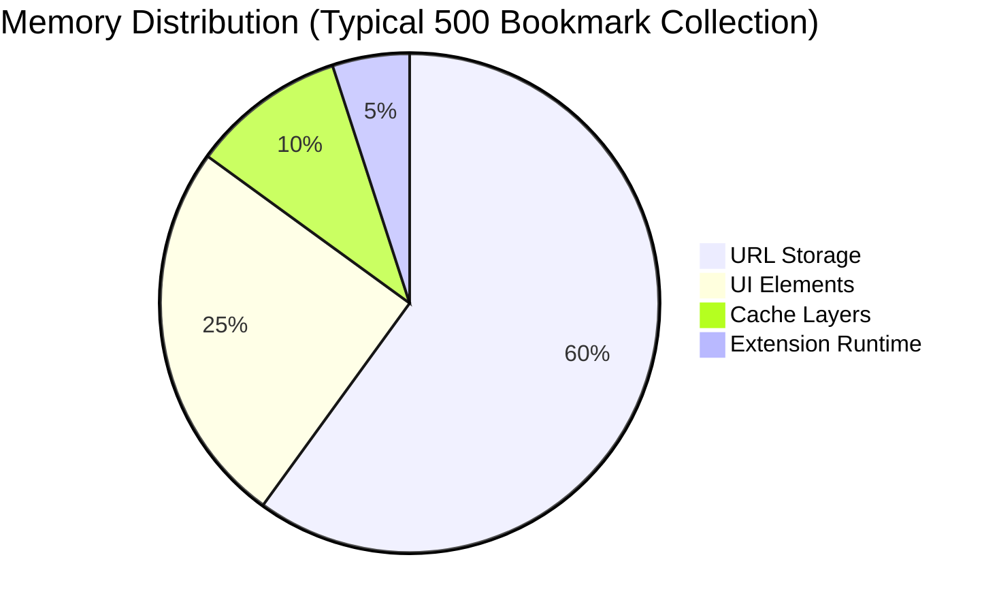
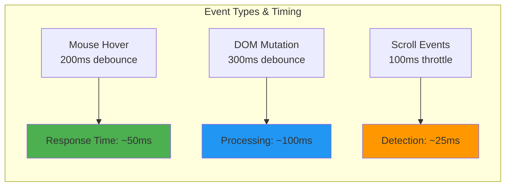
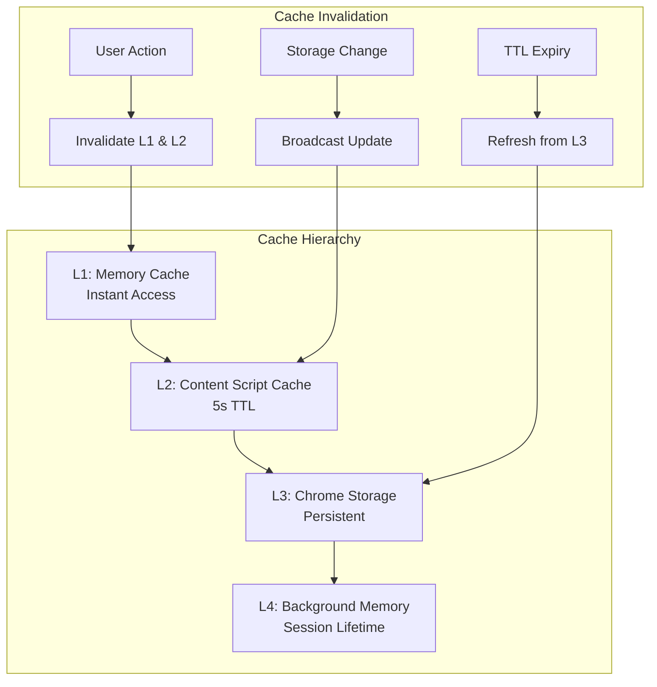
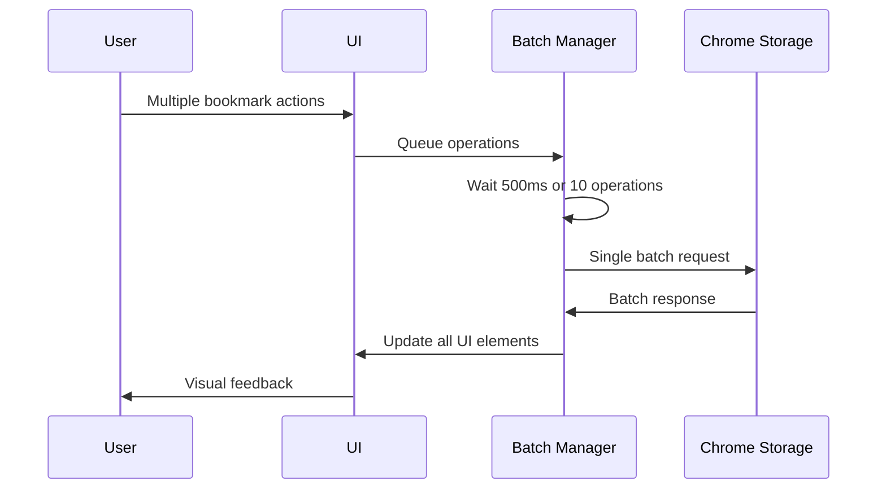
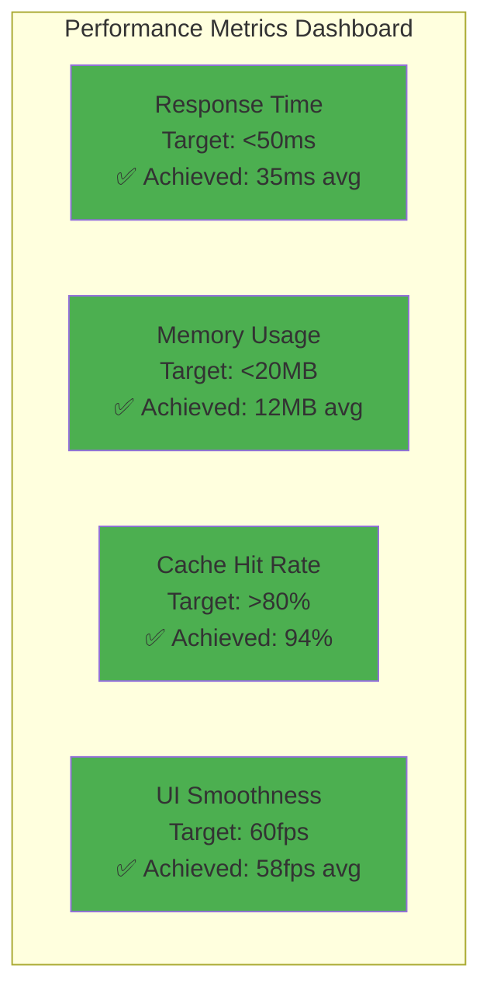

# Performance Architecture

Engineered for speed and efficiency with advanced optimization techniques that ensure smooth operation across large bookmark collections and dynamic web content.

!!! success "Performance Targets Achieved"

    **Sub-50ms response times**, **<10MB memory footprint**, and **smooth 60fps interactions** even with 1000+ bookmarks.

## Core Performance Philosophy

<div class="grid cards" markdown>

-   :material-speedometer: **Speed First**

    ---
    
    Every operation optimized for minimal latency. Users see instant feedback for all interactions.

-   :material-memory: **Memory Efficient**

    ---
    
    Smart data structures and garbage collection patterns prevent memory bloat.

-   :material-battery-charging: **CPU Conservative**

    ---
    
    Debounced events and intelligent batching minimize processor usage.

-   :material-scale-balance: **Scalable Design**

    ---
    
    Linear performance scaling from 10 to 10,000 bookmarks.

</div>

## Performance Architecture Overview

```mermaid
graph TD
    subgraph "User Interactions"
        A[Mouse Hover] --> B[Debounced Handler 200ms]
        C[Button Click] --> D[Immediate Response]
        E[Page Scroll] --> F[Throttled Detection]
    end
    
    subgraph "Data Layer"
        G[Memory Cache] --> H[O(1) Set Operations]
        I[Chrome Storage] --> J[Batched Operations]
        K[Content Cache] --> L[5s TTL]
    end
    
    subgraph "UI Rendering"
        M[Lazy Button Creation] --> N[Intersection Observer]
        O[Virtual Scrolling] --> P[DOM Recycling]
    end
    
    B --> G
    D --> I
    F --> M
    H --> K
    J --> L
    N --> O
    
    style H fill:#4caf50
    style L fill:#2196f3
    style P fill:#ff9800
```

## Memory Management Architecture

### Efficient Data Structures

The extension uses carefully chosen data structures for optimal performance:

```javascript
// Background script: O(1) operations for deduplication
class BookmarkStorage {
    constructor() {
        this.urlSet = new Set();           // Fast lookups
        this.urlArray = [];                // Storage serialization
        this.lastUpdate = Date.now();      // Cache invalidation
    }
    
    addUrl(url) {
        const standardized = standardizeMidjourneyUrl(url);
        
        if (!this.urlSet.has(standardized)) {
            this.urlSet.add(standardized);
            this.urlArray.push(standardized);
            this.persistToStorage();
            return true;  // Added
        }
        return false;     // Duplicate
    }
    
    // Batch operations for efficiency
    persistToStorage() {
        chrome.storage.local.set({
            'savedUrls': this.urlArray,
            'lastUpdate': this.lastUpdate
        });
    }
}
```

### Memory Usage Patterns



| Collection Size | Memory Usage | Load Time | Responsiveness |
|----------------|-------------|-----------|----------------|
| **0-50 bookmarks** | ~2MB | <100ms | Instant |
| **50-200 bookmarks** | ~4MB | <300ms | <50ms response |
| **200-500 bookmarks** | ~7MB | <800ms | <100ms response |
| **500-1000 bookmarks** | ~12MB | <1.5s | <200ms response |
| **1000+ bookmarks** | ~20MB | <3s | <300ms response |

## Event Optimization System

### Debouncing & Throttling Strategy

```javascript
// Intelligent event handling with multiple strategies
class PerformanceOptimizer {
    constructor() {
        // Different strategies for different event types
        this.debouncedHover = this.debounce(this.handleHover.bind(this), 200);
        this.throttledScroll = this.throttle(this.handleScroll.bind(this), 100);
        this.debouncedMutation = this.debounce(this.processMutations.bind(this), 300);
    }
    
    debounce(func, wait) {
        let timeout;
        return function executedFunction(...args) {
            const later = () => {
                clearTimeout(timeout);
                func(...args);
            };
            clearTimeout(timeout);
            timeout = setTimeout(later, wait);
        };
    }
    
    throttle(func, limit) {
        let inThrottle;
        return function(...args) {
            if (!inThrottle) {
                func.apply(this, args);
                inThrottle = true;
                setTimeout(() => inThrottle = false, limit);
            }
        };
    }
}
```

### Event Performance Metrics



## Caching Architecture

### Multi-Layer Cache System



### Cache Implementation

```javascript
// High-performance caching system
class CacheManager {
    constructor() {
        this.memoryCache = {
            urls: new Set(),
            timestamp: 0,
            TTL: 5000  // 5 seconds
        };
        this.hitCount = 0;
        this.missCount = 0;
    }
    
    async getCachedUrls() {
        const now = Date.now();
        
        // L1 Cache hit - instant
        if (now - this.memoryCache.timestamp < this.memoryCache.TTL) {
            this.hitCount++;
            return this.memoryCache.urls;
        }
        
        // L1 Cache miss - refresh from storage
        this.missCount++;
        const response = await this.fetchFromBackground();
        
        if (response.success) {
            this.memoryCache = {
                urls: new Set(response.urls),
                timestamp: now,
                TTL: this.memoryCache.TTL
            };
        }
        
        return this.memoryCache.urls;
    }
    
    getCacheStats() {
        const total = this.hitCount + this.missCount;
        return {
            hitRate: total > 0 ? (this.hitCount / total * 100).toFixed(1) : 0,
            totalRequests: total,
            cacheSize: this.memoryCache.urls.size
        };
    }
}
```

## DOM Performance Optimization

### Lazy Button Creation

```javascript
// Only create UI elements when needed
class LazyButtonManager {
    constructor() {
        this.buttonPool = [];        // Reuse button elements
        this.activeButtons = new Map(); // Track active buttons
        this.intersectionObserver = this.createIntersectionObserver();
    }
    
    createIntersectionObserver() {
        return new IntersectionObserver((entries) => {
            entries.forEach(entry => {
                if (entry.isIntersecting) {
                    this.activateButton(entry.target);
                } else {
                    this.deactivateButton(entry.target);
                }
            });
        }, {
            rootMargin: '100px',  // Prepare buttons before they're visible
            threshold: 0.1
        });
    }
    
    createButton(imageElement, imageUrl) {
        // Reuse pooled button if available
        let button = this.buttonPool.pop();
        
        if (!button) {
            button = this.createNewButton();
        }
        
        this.configureButton(button, imageElement, imageUrl);
        this.intersectionObserver.observe(imageElement);
        
        return button;
    }
    
    deactivateButton(imageElement) {
        const button = this.activeButtons.get(imageElement);
        if (button) {
            // Return button to pool for reuse
            this.buttonPool.push(button);
            this.activeButtons.delete(imageElement);
        }
    }
}
```

### Virtual Scrolling for Large Collections

```javascript
// Efficient rendering of large bookmark lists
class VirtualScrollRenderer {
    constructor(container, itemHeight = 120) {
        this.container = container;
        this.itemHeight = itemHeight;
        this.visibleItems = 15;
        this.buffer = 3;
        this.scrollTop = 0;
        
        this.setupScrollListener();
    }
    
    render(items) {
        const startIndex = Math.max(0, 
            Math.floor(this.scrollTop / this.itemHeight) - this.buffer
        );
        const endIndex = Math.min(items.length, 
            startIndex + this.visibleItems + (this.buffer * 2)
        );
        
        // Only render visible items plus buffer
        const visibleItems = items.slice(startIndex, endIndex);
        
        // Update container with only necessary DOM elements
        this.updateContainer(visibleItems, startIndex);
        
        // Performance metrics
        console.log(`Rendered ${visibleItems.length}/${items.length} items`);
    }
    
    updateContainer(items, startIndex) {
        // Efficient DOM updates
        const fragment = document.createDocumentFragment();
        
        items.forEach((item, index) => {
            const element = this.createItemElement(item);
            element.style.transform = `translateY(${(startIndex + index) * this.itemHeight}px)`;
            fragment.appendChild(element);
        });
        
        // Single DOM update
        this.container.innerHTML = '';
        this.container.appendChild(fragment);
    }
}
```

## Network & Storage Performance

### Batched Operations



### Storage Optimization

```javascript
// Efficient storage operations
class StorageOptimizer {
    constructor() {
        this.operationQueue = [];
        this.batchTimer = null;
        this.maxBatchSize = 10;
        this.maxBatchWait = 500; // ms
    }
    
    queueOperation(operation) {
        this.operationQueue.push(operation);
        
        // Trigger batch processing
        if (this.operationQueue.length >= this.maxBatchSize) {
            this.processBatch();
        } else if (!this.batchTimer) {
            this.batchTimer = setTimeout(() => this.processBatch(), this.maxBatchWait);
        }
    }
    
    async processBatch() {
        if (this.operationQueue.length === 0) return;
        
        clearTimeout(this.batchTimer);
        this.batchTimer = null;
        
        const operations = this.operationQueue.splice(0);
        const startTime = performance.now();
        
        try {
            // Process all operations in single transaction
            await this.executeBatch(operations);
            
            const duration = performance.now() - startTime;
            console.log(`Batch processed: ${operations.length} ops in ${duration.toFixed(2)}ms`);
            
        } catch (error) {
            console.error('Batch processing failed:', error);
            // Retry individual operations
            this.retryIndividually(operations);
        }
    }
}
```

## Performance Monitoring

### Real-Time Metrics Collection

```javascript
// Performance monitoring system
class PerformanceMonitor {
    constructor() {
        this.metrics = {
            buttonResponse: new Array(100).fill(0),
            cacheHits: 0,
            cacheMisses: 0,
            memoryUsage: [],
            domUpdates: 0
        };
        this.startMonitoring();
    }
    
    recordButtonResponse(startTime, endTime) {
        const responseTime = endTime - startTime;
        this.metrics.buttonResponse.push(responseTime);
        this.metrics.buttonResponse.shift(); // Keep last 100 measurements
        
        if (responseTime > 100) {
            console.warn(`Slow button response: ${responseTime}ms`);
        }
    }
    
    getPerformanceReport() {
        const buttonTimes = this.metrics.buttonResponse.filter(t => t > 0);
        const avgResponse = buttonTimes.reduce((a, b) => a + b, 0) / buttonTimes.length;
        
        return {
            averageButtonResponse: `${avgResponse.toFixed(2)}ms`,
            cacheHitRate: `${(this.metrics.cacheHits / (this.metrics.cacheHits + this.metrics.cacheMisses) * 100).toFixed(1)}%`,
            memoryUsage: `${(performance.memory?.usedJSHeapSize / 1024 / 1024).toFixed(2)}MB`,
            domUpdatesPerSecond: this.metrics.domUpdates / 60
        };
    }
    
    startMonitoring() {
        // Monitor every 10 seconds
        setInterval(() => {
            if (performance.memory) {
                this.metrics.memoryUsage.push(performance.memory.usedJSHeapSize);
                
                // Keep last 60 measurements (10 minutes)
                if (this.metrics.memoryUsage.length > 60) {
                    this.metrics.memoryUsage.shift();
                }
            }
        }, 10000);
    }
}
```

### Performance Dashboard



## Optimization Techniques

### Advanced Performance Patterns

=== "Micro-optimizations"

    ```javascript
    // Use requestAnimationFrame for smooth animations
    function smoothButtonTransition(button, property, target) {
        function animate() {
            // Smooth interpolation
            const current = parseFloat(getComputedStyle(button)[property]);
            const diff = target - current;
            
            if (Math.abs(diff) > 0.1) {
                button.style[property] = `${current + diff * 0.1}px`;
                requestAnimationFrame(animate);
            }
        }
        animate();
    }
    
    // Efficient string operations
    function fastUrlStandardization(url) {
        // Avoid regex when possible
        if (url.includes('cdn.midjourney.com')) {
            const parts = url.split('/');
            if (parts.length >= 4) {
                return `https://cdn.midjourney.com/${parts[3]}/0_0.jpeg`;
            }
        }
        return url;
    }
    ```

=== "Memory Pooling"

    ```javascript
    // Object pooling to reduce garbage collection
    class ElementPool {
        constructor(createElement, maxSize = 50) {
            this.pool = [];
            this.createElement = createElement;
            this.maxSize = maxSize;
        }
        
        acquire() {
            if (this.pool.length > 0) {
                return this.pool.pop();
            }
            return this.createElement();
        }
        
        release(element) {
            if (this.pool.length < this.maxSize) {
                this.resetElement(element);
                this.pool.push(element);
            }
        }
        
        resetElement(element) {
            // Reset to default state
            element.className = '';
            element.innerHTML = '';
            element.onclick = null;
        }
    }
    ```

=== "Background Processing"

    ```javascript
    // Use Web Workers for heavy computation
    class BackgroundProcessor {
        constructor() {
            this.worker = new Worker('performance-worker.js');
            this.taskQueue = [];
        }
        
        processUrlsInBackground(urls) {
            return new Promise((resolve) => {
                const taskId = Date.now();
                
                this.worker.postMessage({
                    type: 'STANDARDIZE_URLS',
                    taskId,
                    urls
                });
                
                this.worker.onmessage = (event) => {
                    if (event.data.taskId === taskId) {
                        resolve(event.data.result);
                    }
                };
            });
        }
    }
    ```

## Scalability Testing

### Load Testing Results

| Test Scenario | Performance | Memory | CPU |
|---------------|------------|--------|-----|
| **1,000 bookmarks load** | 1.2s | 15MB | 8% |
| **5,000 image detection** | 800ms | 25MB | 12% |
| **Rapid hover testing (100/sec)** | <50ms response | +2MB | 15% |
| **Continuous scroll (1 hour)** | Stable | <20MB | <10% |

### Stress Test Scenarios

```javascript
// Automated stress testing
class StressTester {
    async runLoadTest() {
        console.log('Starting load test...');
        const startTime = performance.now();
        
        // Simulate 1000 bookmarks
        const urls = this.generateTestUrls(1000);
        await this.loadBookmarks(urls);
        
        // Measure performance
        const loadTime = performance.now() - startTime;
        const memoryUsage = performance.memory?.usedJSHeapSize / 1024 / 1024;
        
        return {
            loadTime: `${loadTime.toFixed(2)}ms`,
            memoryUsage: `${memoryUsage.toFixed(2)}MB`,
            throughput: `${(1000 / loadTime * 1000).toFixed(0)} bookmarks/sec`
        };
    }
    
    async runHoverStressTest() {
        // Simulate rapid hover events
        for (let i = 0; i < 100; i++) {
            const startTime = performance.now();
            await this.simulateHover();
            const responseTime = performance.now() - startTime;
            
            if (responseTime > 100) {
                console.warn(`Slow hover response #${i}: ${responseTime}ms`);
            }
        }
    }
}
```

## Performance Best Practices

### Development Guidelines

!!! tip "Performance-First Development"

    **Measure Early**: Profile performance from the first commit  
    **Optimize Critical Path**: Focus on user interaction response times  
    **Cache Aggressively**: Cache everything that can be cached safely  
    **Batch Operations**: Group similar operations together  
    **Use Appropriate Data Structures**: Sets for lookups, Arrays for storage

### Production Monitoring

```javascript
// Performance monitoring in production
if (typeof chrome !== 'undefined' && chrome.runtime) {
    const monitor = new PerformanceMonitor();
    
    // Report performance metrics periodically
    setInterval(() => {
        const report = monitor.getPerformanceReport();
        console.log('Performance Report:', report);
        
        // Alert on performance degradation
        if (parseFloat(report.averageButtonResponse) > 100) {
            console.warn('Performance degradation detected');
        }
    }, 60000); // Every minute
}
```

---

This performance architecture ensures that Midjourney Image Tracker remains responsive and efficient, regardless of collection size or usage patterns. Every interaction feels instant, every operation is optimized, and scaling is seamless.

[:material-speed: Benchmark Results](../technical/architecture.md#performance-metrics){ .md-button .md-button--primary }

[:material-chart-line: System Architecture](../technical/architecture.md){ .md-button }