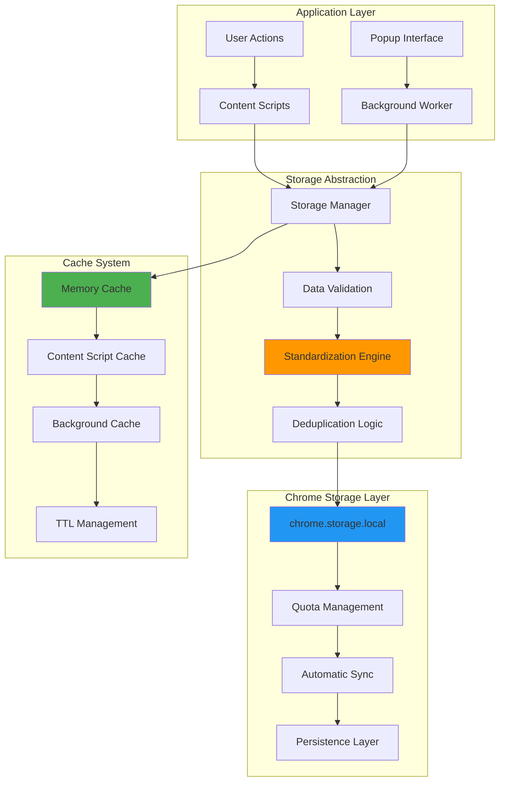
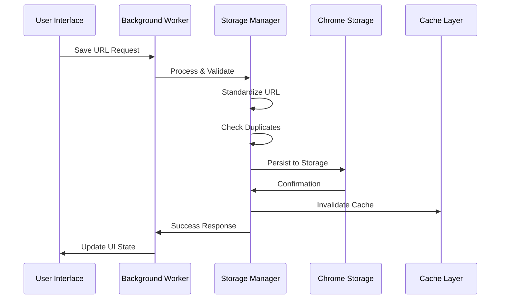
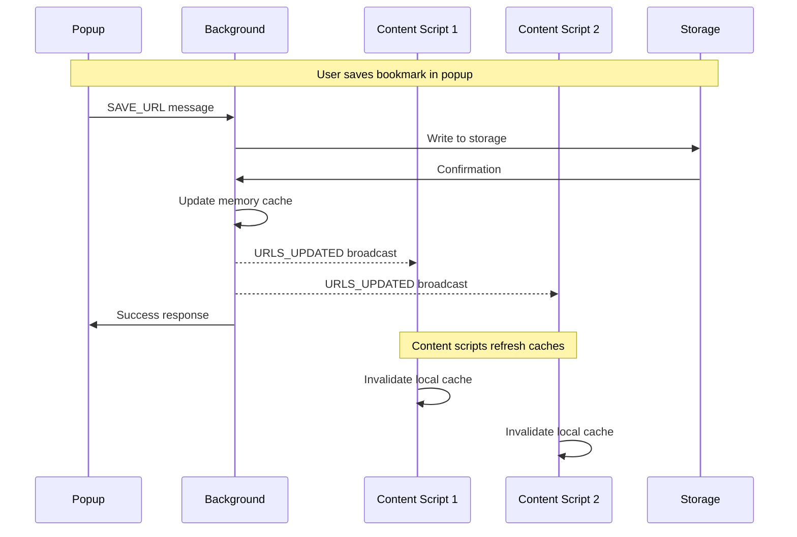
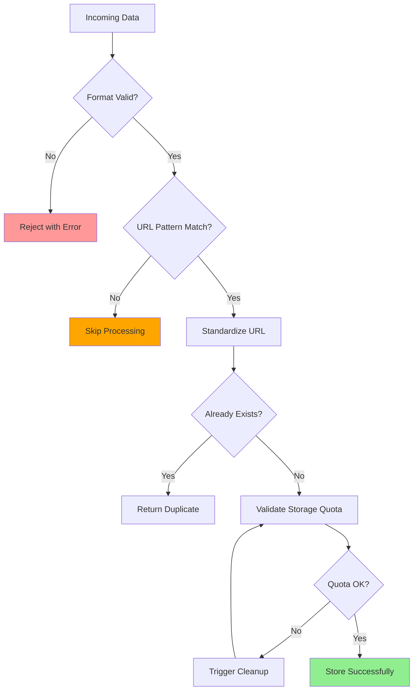
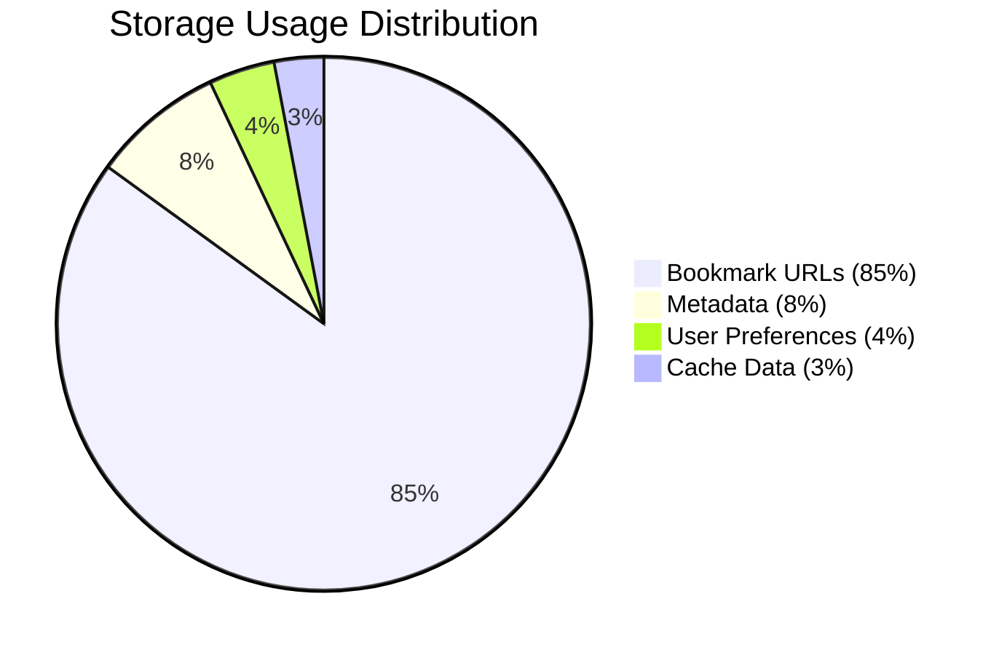

# Storage System

Robust data persistence architecture built on Chrome's local storage with intelligent caching, efficient synchronization, and comprehensive data management capabilities.

!!! success "Storage Excellence"

    **5MB capacity**, **zero external dependencies**, **instant synchronization**, and **automatic backup** - all while maintaining complete user privacy.

## Storage Architecture Overview



## Data Structure Design

### Core Storage Schema

The extension uses a carefully designed data structure optimized for both storage efficiency and runtime performance:

```javascript
// Chrome Storage Schema
{
  // Primary bookmark data
  "savedUrls": [
    "https://cdn.midjourney.com/uuid1/0_0.jpeg",
    "https://cdn.midjourney.com/uuid2/0_0.jpeg",
    "https://cdn.midjourney.com/uuid3/0_0.jpeg"
  ],
  
  // Metadata for optimization
  "storageMetadata": {
    "version": "1.0.0",
    "lastUpdate": 1694012345678,
    "totalBookmarks": 247,
    "storageUsed": 12483,  // bytes
    "lastCleanup": 1694000000000
  },
  
  // User preferences  
  "userPreferences": {
    "exportFormat": "html",
    "theme": "auto",
    "buttonPosition": "top-right"
  }
}
```

### Runtime Data Structures

```javascript
// Background script optimized structures
class StorageManager {
    constructor() {
        // O(1) duplicate detection
        this.urlSet = new Set();
        
        // Storage serialization
        this.urlArray = [];
        
        // Performance tracking
        this.stats = {
            totalOperations: 0,
            cacheHits: 0,
            storageWrites: 0,
            lastOptimization: Date.now()
        };
    }
    
    // Efficient URL standardization and deduplication
    addUrl(rawUrl) {
        const standardizedUrl = standardizeMidjourneyUrl(rawUrl);
        
        if (!this.urlSet.has(standardizedUrl)) {
            this.urlSet.add(standardizedUrl);
            this.urlArray.push(standardizedUrl);
            this.scheduleStorageUpdate();
            return { success: true, added: true };
        }
        
        return { success: true, added: false, reason: 'duplicate' };
    }
}
```

## Chrome Storage Integration

### Storage API Utilization



### Quota Management System

```javascript
// Intelligent quota monitoring and management
class QuotaManager {
    constructor() {
        this.maxQuota = 5 * 1024 * 1024; // 5MB Chrome limit
        this.warningThreshold = 0.8;      // 80% warning
        this.cleanupThreshold = 0.9;      // 90% cleanup
    }
    
    async checkQuotaUsage() {
        const bytesInUse = await this.getBytesInUse();
        const usagePercent = bytesInUse / this.maxQuota;
        
        return {
            bytesUsed: bytesInUse,
            bytesRemaining: this.maxQuota - bytesInUse,
            percentUsed: (usagePercent * 100).toFixed(1),
            status: this.getQuotaStatus(usagePercent)
        };
    }
    
    getQuotaStatus(percent) {
        if (percent >= this.cleanupThreshold) return 'critical';
        if (percent >= this.warningThreshold) return 'warning';
        return 'normal';
    }
    
    async getBytesInUse() {
        return new Promise((resolve) => {
            chrome.storage.local.getBytesInUse(null, (bytes) => {
                resolve(bytes);
            });
        });
    }
    
    async performQuotaCleanup() {
        console.log('Starting quota cleanup...');
        
        // Remove old metadata and optimize storage
        await this.cleanupMetadata();
        await this.optimizeUrlStorage();
        
        const newUsage = await this.checkQuotaUsage();
        console.log(`Cleanup complete. Usage: ${newUsage.percentUsed}%`);
        
        return newUsage;
    }
}
```

### Storage Persistence Patterns

=== "Immediate Writes"

    ```javascript
    // Critical data - write immediately
    async function saveBookmarkImmediate(url) {
        try {
            const result = await chrome.storage.local.set({
                'savedUrls': urlArray,
                'lastUpdate': Date.now()
            });
            
            console.log('Bookmark saved immediately');
            return { success: true };
        } catch (error) {
            console.error('Immediate save failed:', error);
            return { success: false, error: error.message };
        }
    }
    ```

=== "Batched Writes"

    ```javascript
    // Non-critical data - batch for efficiency
    class BatchedStorage {
        constructor() {
            this.pendingWrites = new Map();
            this.batchTimer = null;
            this.batchDelay = 1000; // 1 second
        }
        
        queueWrite(key, value) {
            this.pendingWrites.set(key, value);
            
            if (!this.batchTimer) {
                this.batchTimer = setTimeout(() => {
                    this.flushWrites();
                }, this.batchDelay);
            }
        }
        
        async flushWrites() {
            if (this.pendingWrites.size === 0) return;
            
            const writeData = Object.fromEntries(this.pendingWrites);
            this.pendingWrites.clear();
            this.batchTimer = null;
            
            try {
                await chrome.storage.local.set(writeData);
                console.log(`Batched write: ${Object.keys(writeData).length} keys`);
            } catch (error) {
                console.error('Batched write failed:', error);
            }
        }
    }
    ```

## Multi-Level Caching Architecture

### Cache Hierarchy Design

```mermaid
graph TD
    subgraph "L1 Cache - Memory (Instant)"
        A[Background Memory] --> B[URL Set<br/>O(1) lookups]
        C[Content Script Memory] --> D[Cached URLs<br/>5s TTL]
    end
    
    subgraph "L2 Cache - Extension Context"
        E[Service Worker Cache] --> F[Session Storage]
        G[Content Script Cache] --> H[Page-level Cache]
    end
    
    subgraph "L3 Storage - Persistent"  
        I[Chrome Storage] --> J[Local Storage API]
        J --> K[Disk Persistence]
    end
    
    B -.->|Cache Miss| E
    D -.->|TTL Expired| G
    F -.->|Not Found| I
    H -.->|Invalid| I
    
    style A fill:#4caf50
    style C fill:#4caf50
    style I fill:#2196f3
```

### Cache Implementation

```javascript
// Sophisticated caching system with TTL and invalidation
class CacheSystem {
    constructor() {
        this.caches = {
            // L1: Ultra-fast memory cache
            memory: {
                data: new Set(),
                timestamp: 0,
                ttl: 1000  // 1 second
            },
            
            // L2: Content script cache  
            content: {
                data: new Set(),
                timestamp: 0,
                ttl: 5000  // 5 seconds
            },
            
            // L3: Background worker cache
            background: {
                data: new Set(),
                timestamp: 0,
                ttl: 30000 // 30 seconds
            }
        };
    }
    
    async get(cacheLevel = 'memory') {
        const cache = this.caches[cacheLevel];
        const now = Date.now();
        
        // Check if cache is valid
        if (now - cache.timestamp < cache.ttl && cache.data.size > 0) {
            return { hit: true, data: cache.data };
        }
        
        // Cache miss - refresh from next level
        return this.refreshCache(cacheLevel);
    }
    
    async refreshCache(cacheLevel) {
        const startTime = performance.now();
        
        try {
            // Fetch from storage
            const response = await chrome.runtime.sendMessage({ type: 'GET_URLS' });
            
            if (response.success) {
                const cache = this.caches[cacheLevel];
                cache.data = new Set(response.urls);
                cache.timestamp = Date.now();
                
                const duration = performance.now() - startTime;
                console.log(`Cache refreshed (${cacheLevel}): ${duration.toFixed(2)}ms`);
                
                return { hit: false, data: cache.data, refreshTime: duration };
            }
        } catch (error) {
            console.error(`Cache refresh failed (${cacheLevel}):`, error);
        }
        
        return { hit: false, data: new Set(), error: 'refresh_failed' };
    }
    
    invalidate(cacheLevel = 'all') {
        if (cacheLevel === 'all') {
            Object.values(this.caches).forEach(cache => {
                cache.timestamp = 0;
                cache.data.clear();
            });
        } else {
            const cache = this.caches[cacheLevel];
            if (cache) {
                cache.timestamp = 0;
                cache.data.clear();
            }
        }
        
        console.log(`Cache invalidated: ${cacheLevel}`);
    }
}
```

## Data Synchronization

### Cross-Context Synchronization



### Synchronization Implementation

```javascript
// Real-time synchronization system
class SynchronizationManager {
    constructor() {
        this.subscribers = new Set();
        this.lastSyncTimestamp = 0;
        this.syncQueue = [];
    }
    
    // Subscribe to storage changes
    subscribe(callback) {
        this.subscribers.add(callback);
        
        return () => {
            this.subscribers.delete(callback);
        };
    }
    
    // Broadcast changes to all subscribers
    broadcastUpdate(changeType, data) {
        const update = {
            type: changeType,
            data: data,
            timestamp: Date.now()
        };
        
        // Send to all active content scripts
        chrome.tabs.query({}, (tabs) => {
            tabs.forEach(tab => {
                chrome.tabs.sendMessage(tab.id, {
                    type: 'URLS_UPDATED',
                    ...update
                }).catch(() => {
                    // Tab might not have content script
                });
            });
        });
        
        // Notify local subscribers
        this.subscribers.forEach(callback => {
            try {
                callback(update);
            } catch (error) {
                console.error('Subscriber callback failed:', error);
            }
        });
    }
    
    // Handle storage conflicts
    async resolveStorageConflict(localData, remoteData) {
        // Merge strategy: union of both datasets
        const mergedUrls = new Set([...localData, ...remoteData]);
        
        await chrome.storage.local.set({
            'savedUrls': Array.from(mergedUrls),
            'lastUpdate': Date.now(),
            'conflictResolved': true
        });
        
        return Array.from(mergedUrls);
    }
}
```

## Data Integrity & Validation

### Validation Pipeline



### Validation Implementation

```javascript
// Comprehensive data validation system
class DataValidator {
    constructor() {
        this.validationRules = {
            url: {
                required: true,
                type: 'string',
                pattern: /^https:\/\/cdn\.midjourney\.com\/.+\.(png|jpeg|webp)(\?.*)?$/i,
                maxLength: 500
            },
            timestamp: {
                type: 'number',
                min: 1600000000000, // Reasonable minimum timestamp
                max: Date.now() + 86400000 // Maximum 1 day in future
            }
        };
    }
    
    validateBookmarkData(data) {
        const errors = [];
        
        // URL validation
        if (!data.url || typeof data.url !== 'string') {
            errors.push('URL is required and must be a string');
        } else {
            if (!this.validationRules.url.pattern.test(data.url)) {
                errors.push('URL must be a valid Midjourney CDN URL');
            }
            
            if (data.url.length > this.validationRules.url.maxLength) {
                errors.push(`URL exceeds maximum length of ${this.validationRules.url.maxLength}`);
            }
        }
        
        // Sanitize URL
        try {
            const sanitized = this.sanitizeUrl(data.url);
            data.url = sanitized;
        } catch (error) {
            errors.push(`URL sanitization failed: ${error.message}`);
        }
        
        return {
            valid: errors.length === 0,
            errors: errors,
            sanitized: data
        };
    }
    
    sanitizeUrl(url) {
        // Remove potentially harmful characters
        const cleaned = url.trim()
                           .replace(/[<>'"]/g, '')  // Remove HTML chars
                           .replace(/javascript:/gi, '') // Remove JS protocol
                           .replace(/data:/gi, '');      // Remove data protocol
        
        // Validate with URL constructor
        const parsed = new URL(cleaned);
        
        // Force HTTPS
        parsed.protocol = 'https:';
        
        return parsed.href;
    }
}
```

## Storage Migration & Versioning

### Schema Evolution

```javascript
// Storage schema migration system
class StorageMigrator {
    constructor() {
        this.currentVersion = '1.0.0';
        this.migrations = {
            '0.9.0': this.migrateFrom090.bind(this),
            '0.8.0': this.migrateFrom080.bind(this),
        };
    }
    
    async performMigration() {
        const stored = await chrome.storage.local.get(['storageMetadata']);
        const currentVersion = stored.storageMetadata?.version || '0.8.0';
        
        if (currentVersion === this.currentVersion) {
            return { migrated: false, message: 'Already current version' };
        }
        
        console.log(`Migrating storage from ${currentVersion} to ${this.currentVersion}`);
        
        try {
            // Apply migrations in sequence
            for (const version of Object.keys(this.migrations)) {
                if (this.isVersionOlder(currentVersion, version)) {
                    await this.migrations[version]();
                    console.log(`Applied migration: ${version}`);
                }
            }
            
            // Update version metadata
            await this.updateVersionMetadata();
            
            return { 
                migrated: true, 
                from: currentVersion, 
                to: this.currentVersion 
            };
            
        } catch (error) {
            console.error('Migration failed:', error);
            return { migrated: false, error: error.message };
        }
    }
    
    async migrateFrom090() {
        // Migration from v0.9.0: Add metadata structure
        const data = await chrome.storage.local.get(['savedUrls']);
        
        if (data.savedUrls) {
            await chrome.storage.local.set({
                'savedUrls': data.savedUrls,
                'storageMetadata': {
                    version: '1.0.0',
                    migrationDate: Date.now(),
                    totalBookmarks: data.savedUrls.length,
                    lastUpdate: Date.now()
                }
            });
        }
    }
}
```

## Backup & Recovery

### Automatic Backup System

```javascript
// Automated backup and recovery system  
class BackupManager {
    constructor() {
        this.backupInterval = 24 * 60 * 60 * 1000; // 24 hours
        this.maxBackups = 7; // Keep 7 days of backups
        this.startBackupScheduler();
    }
    
    startBackupScheduler() {
        setInterval(() => {
            this.createBackup();
        }, this.backupInterval);
    }
    
    async createBackup() {
        try {
            const allData = await chrome.storage.local.get(null);
            const backup = {
                timestamp: Date.now(),
                version: chrome.runtime.getManifest().version,
                data: allData
            };
            
            // Store backup with timestamp key
            const backupKey = `backup_${Date.now()}`;
            await chrome.storage.local.set({ [backupKey]: backup });
            
            // Cleanup old backups
            await this.cleanupOldBackups();
            
            console.log(`Backup created: ${backupKey}`);
            return { success: true, backupKey };
            
        } catch (error) {
            console.error('Backup creation failed:', error);
            return { success: false, error: error.message };
        }
    }
    
    async restoreFromBackup(backupKey) {
        try {
            const backup = await chrome.storage.local.get([backupKey]);
            
            if (!backup[backupKey]) {
                throw new Error('Backup not found');
            }
            
            const backupData = backup[backupKey];
            
            // Validate backup data
            if (!backupData.data || !backupData.timestamp) {
                throw new Error('Invalid backup format');
            }
            
            // Clear current data and restore backup
            await chrome.storage.local.clear();
            await chrome.storage.local.set(backupData.data);
            
            console.log(`Restored from backup: ${backupKey}`);
            return { success: true, restored: Object.keys(backupData.data) };
            
        } catch (error) {
            console.error('Backup restoration failed:', error);
            return { success: false, error: error.message };
        }
    }
}
```

## Storage Analytics

### Usage Analytics & Insights



### Analytics Implementation

```javascript
// Storage analytics and insights
class StorageAnalytics {
    async generateReport() {
        const data = await chrome.storage.local.get(null);
        const bytesUsed = await this.getBytesInUse();
        
        return {
            overview: {
                totalBookmarks: data.savedUrls?.length || 0,
                storageUsed: `${(bytesUsed / 1024).toFixed(2)} KB`,
                storagePercent: `${(bytesUsed / (5 * 1024 * 1024) * 100).toFixed(1)}%`,
                lastUpdate: new Date(data.storageMetadata?.lastUpdate || 0).toISOString()
            },
            
            breakdown: {
                bookmarkData: this.calculateDataSize(data.savedUrls),
                metadata: this.calculateDataSize(data.storageMetadata),
                preferences: this.calculateDataSize(data.userPreferences),
                backups: this.calculateBackupSize(data)
            },
            
            health: {
                status: this.getStorageHealth(bytesUsed),
                recommendations: this.getRecommendations(data, bytesUsed)
            },
            
            trends: {
                averageBookmarksPerDay: this.calculateDailyAverage(data),
                growthRate: this.calculateGrowthRate(data)
            }
        };
    }
    
    getStorageHealth(bytesUsed) {
        const percent = bytesUsed / (5 * 1024 * 1024);
        
        if (percent < 0.5) return 'excellent';
        if (percent < 0.7) return 'good';
        if (percent < 0.85) return 'warning';
        return 'critical';
    }
    
    getRecommendations(data, bytesUsed) {
        const recommendations = [];
        
        if (bytesUsed > 4 * 1024 * 1024) { // > 4MB
            recommendations.push('Consider exporting and cleaning old bookmarks');
        }
        
        if (data.savedUrls?.length > 1000) {
            recommendations.push('Enable automatic cleanup for better performance');
        }
        
        return recommendations;
    }
}
```

---

This storage system provides enterprise-grade data management with the simplicity of local storage, ensuring your bookmark collection is always safe, fast, and accessible while maintaining complete privacy and control.

[:material-database: Storage Architecture](../technical/architecture.md#storage-architecture){ .md-button .md-button--primary }

[:material-shield-lock: Privacy & Security](../how-to/privacy-security.md){ .md-button }